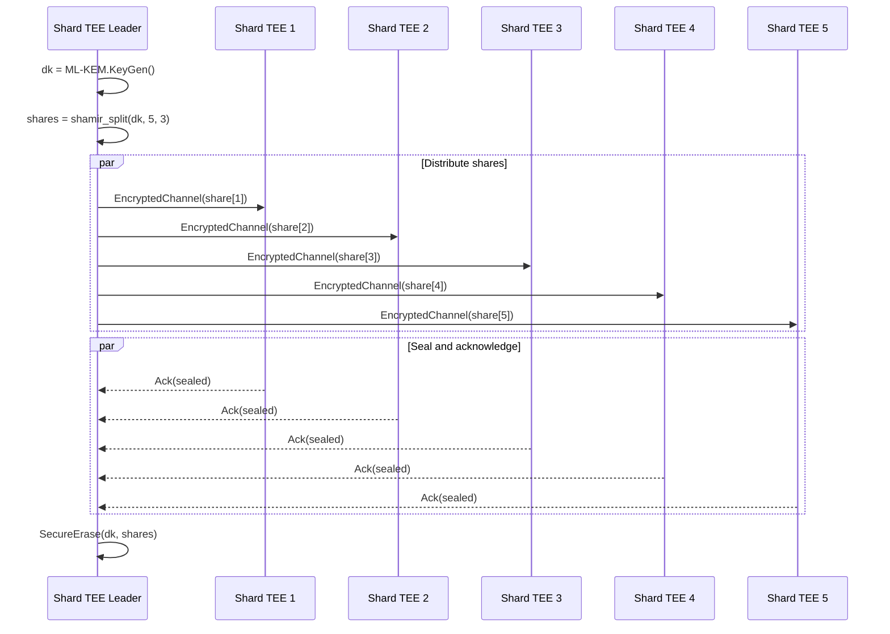
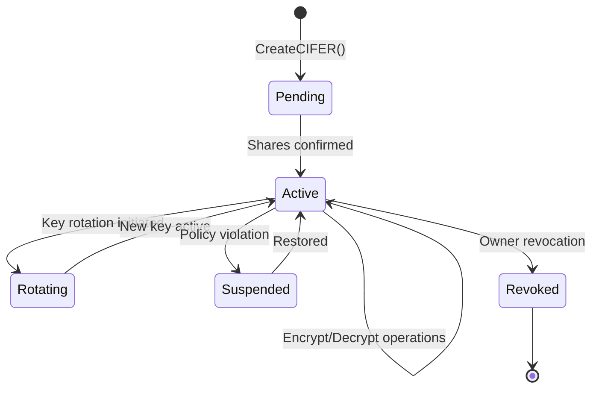

# CIFER Security — Cryptographic Specification

> **Document Version:** 0.2  
> **Last Updated:** 2026-01-08  
> **Classification:** Technical Specification  
> **Target Audience:** Cryptographers, Security Researchers, Technical Due Diligence

---

## Table of Contents

1. [Introduction and Scope](#1-introduction-and-scope)
2. [Notation and Definitions](#2-notation-and-definitions)
3. [Security Model and Definitions](#3-security-model-and-definitions)
4. [ML-KEM-768 Specification](#4-ml-kem-768-specification)
5. [Key Derivation Function](#5-key-derivation-function)
6. [Authenticated Encryption](#6-authenticated-encryption)
7. [Secret Sharing Scheme](#7-secret-sharing-scheme)
8. [Ciphertext Format](#8-ciphertext-format)
9. [Entropy and Randomness](#9-entropy-and-randomness)
10. [Key Lifecycle Management](#10-key-lifecycle-management)
11. [Security Proofs and Reductions](#11-security-proofs-and-reductions)
12. [References](#12-references)

---

## 1. Introduction and Scope

This document provides the formal cryptographic specification for CIFER Security's zero-key encryption system. It defines all cryptographic primitives, their parameters, security properties, and composition.

### 1.1 Design Principles

| Principle | Implementation |
|-----------|----------------|
| Post-quantum security | ML-KEM-768 (FIPS 203) for key encapsulation |
| Defense in depth | Layered encryption with independent key material |
| Minimal trust | Threshold secret sharing across TEE network |
| Forward secrecy | Ephemeral KEM operations per encryption |
| Cryptographic agility | Algorithm identifiers enable future upgrades |

### 1.2 Cryptographic Primitive Summary

| Primitive | Algorithm | Standard | Security Level |
|-----------|-----------|----------|----------------|
| Key Encapsulation | ML-KEM-768 | NIST FIPS 203 | 192-bit classical, 128-bit quantum |
| Key Derivation | HKDF-SHA-384 | RFC 5869, NIST SP 800-56C | 192-bit |
| Symmetric Encryption | AES-256-GCM | NIST SP 800-38D | 256-bit |
| Alternative AEAD | XChaCha20-Poly1305 | RFC 8439 + draft-irtf-cfrg-xchacha | 256-bit |
| Secret Sharing | Shamir (5,3) over GF(2^256) | Shamir 1979 | Information-theoretic |
| Hash Function | SHA-384 | NIST FIPS 180-4 | 192-bit collision resistance |

---

## 2. Notation and Definitions

### 2.1 Mathematical Notation

| Symbol | Definition |
|--------|------------|
| \( \mathbb{Z}_q \) | Ring of integers modulo \( q \) |
| \( R_q \) | Polynomial ring \( \mathbb{Z}_q[X]/(X^n + 1) \) |
| \( \leftarrow_\$ \) | Uniform random sampling |
| \( \| \) | Byte string concatenation |
| \( [n] \) | Set \( \{1, 2, \ldots, n\} \) |
| \( \lambda \) | Security parameter (bits) |
| \( \mathsf{negl}(\lambda) \) | Negligible function in \( \lambda \) |
| \( \mathcal{A} \) | Probabilistic polynomial-time adversary |

### 2.2 Byte String Operations

```
len(x)          → Length of byte string x in bytes
x[i:j]          → Slice of x from byte i to byte j (exclusive)
x ⊕ y           → Bitwise XOR of equal-length byte strings
encode_u32_be(n) → 4-byte big-endian encoding of integer n
I2OSP(x, len)   → Integer to Octet String Primitive (RFC 8017)
OS2IP(x)        → Octet String to Integer Primitive (RFC 8017)
```

### 2.3 Domain Separation Constants

All domain separation strings use the prefix `CIFER-v1-` followed by the operation:

```
CONTEXT_KDF_FEK     = "CIFER-v1-kdf-file-encryption-key"
CONTEXT_KDF_HMAC    = "CIFER-v1-kdf-hmac-key"
CONTEXT_SHARE_SEAL  = "CIFER-v1-share-seal"
CONTEXT_ENVELOPE    = "CIFER-v1-envelope"
```

---

## 3. Security Model and Definitions

### 3.1 Threat Model

CIFER's cryptographic design defends against:

| Adversary Class | Capabilities | Mitigation |
|-----------------|--------------|------------|
| **Network adversary** | Passive eavesdropping, active MITM | TLS 1.3 + ML-KEM hybrid |
| **Compromised storage** | Access to ciphertext at rest | AES-256-GCM encryption |
| **Malicious shard TEE** | Control of < t shard enclaves | (t,n) threshold secret sharing |
| **Quantum adversary** | Harvest-now-decrypt-later | ML-KEM-768 post-quantum KEM |
| **Side-channel adversary** | Timing, cache attacks | Constant-time implementations |

### 3.2 IND-CCA2 Security (Indistinguishability under Adaptive Chosen Ciphertext Attack)

**Definition:** A public-key encryption scheme \( \Pi = (\mathsf{KeyGen}, \mathsf{Enc}, \mathsf{Dec}) \) is IND-CCA2 secure if for all PPT adversaries \( \mathcal{A} \):

```
Advantage_IND-CCA2(A) = |Pr[Exp_IND-CCA2-1(A) = 1] - Pr[Exp_IND-CCA2-0(A) = 1]| ≤ negl(λ)
```

**Experiment \( \mathsf{Exp}_{\text{IND-CCA2-}b}(\mathcal{A}) \):**

```
1. (pk, sk) ← KeyGen(1^λ)
2. (m₀, m₁, state) ← A^Dec(sk,·)(pk)    // Query phase 1
3. c* ← Enc(pk, m_b)
4. b' ← A^Dec(sk,·)(c*, state)          // Query phase 2, c* forbidden
5. Return b'
```

### 3.3 EUF-CMA Security (Existential Unforgeability under Chosen Message Attack)

For AEAD tag verification, we require:

```
Advantage_EUF-CMA(A) = Pr[A produces valid (m*, t*) not queried] ≤ negl(λ)
```

### 3.4 Security Composition Theorem

**Theorem 1 (CIFER Composition Security):** The CIFER encryption scheme achieves IND-CCA2 security under the following assumptions:

1. ML-KEM-768 is IND-CCA2 secure (per FIPS 203 security analysis)
2. HKDF-SHA-384 is a secure PRF (per RFC 5869 security analysis)
3. AES-256-GCM is IND-CPA and INT-CTXT secure (per NIST validation)
4. The (t,n) Shamir scheme achieves perfect secrecy for < t shares

**Proof Sketch:** Security follows by a standard hybrid argument:
- Game 0: Real IND-CCA2 game
- Game 1: Replace ML-KEM shared secret with random (by KEM IND-CCA2)
- Game 2: Replace derived FEK with random (by HKDF PRF security)
- Game 3: Replace AEAD ciphertext with encryption of zeros (by AEAD IND-CPA)

The advantage bound is:

```
Adv_CIFER ≤ Adv_ML-KEM + Adv_HKDF-PRF + Adv_AEAD-IND-CPA + Adv_AEAD-INT-CTXT
```

---

## 4. ML-KEM-768 Specification

### 4.1 Parameter Set

CIFER uses **ML-KEM-768** as specified in NIST FIPS 203. Parameters:

| Parameter | Value | Description |
|-----------|-------|-------------|
| \( n \) | 256 | Polynomial degree |
| \( k \) | 3 | Module rank |
| \( q \) | 3329 | Modulus |
| \( \eta_1 \) | 2 | Noise parameter (key generation) |
| \( \eta_2 \) | 2 | Noise parameter (encryption) |
| \( d_u \) | 10 | Ciphertext compression (u) |
| \( d_v \) | 4 | Ciphertext compression (v) |

### 4.2 Key Sizes

| Component | Size (bytes) |
|-----------|--------------|
| Encapsulation key \( ek \) | 1184 |
| Decapsulation key \( dk \) | 2400 |
| Ciphertext \( ct_{kem} \) | 1088 |
| Shared secret \( ss \) | 32 |

### 4.3 Algorithm Interfaces

```
ML-KEM-768.KeyGen() → (ek, dk)
    Input:  None (uses internal randomness)
    Output: Encapsulation key ek (1184 bytes)
            Decapsulation key dk (2400 bytes)
    
ML-KEM-768.Encaps(ek) → (ct_kem, ss)
    Input:  Encapsulation key ek
    Output: Ciphertext ct_kem (1088 bytes)
            Shared secret ss (32 bytes)
    
ML-KEM-768.Decaps(dk, ct_kem) → ss | ⊥
    Input:  Decapsulation key dk
            Ciphertext ct_kem
    Output: Shared secret ss (32 bytes)
            Or ⊥ on failure (implicit rejection)
```

### 4.4 Security Level Justification

| Attack Type | Classical | Quantum (Grover) |
|-------------|-----------|------------------|
| Key recovery | 2^192 operations | 2^128 operations |
| Ciphertext forgery | 2^192 operations | 2^128 operations |

ML-KEM-768 provides NIST Security Level 3, equivalent to AES-192 against classical attacks and AES-128 against quantum attacks.

### 4.5 Implementation Requirements

- **Constant-time:** All operations MUST be constant-time to prevent timing side-channels
- **Implicit rejection:** Decapsulation MUST use implicit rejection (return pseudorandom value on failure)
- **Validated implementation:** Use FIPS 140-3 validated module or equivalent

---

## 5. Key Derivation Function

### 5.1 HKDF Specification

CIFER uses HKDF (RFC 5869) with SHA-384 as the underlying hash function.

```
HKDF(IKM, salt, info, L) → OKM
    IKM:  Input keying material
    salt: Optional salt value (defaults to HashLen zeros)
    info: Context and application-specific info
    L:    Length of output keying material in bytes
    OKM:  Output keying material
```

### 5.2 HKDF-Extract

```
HKDF-Extract(salt, IKM) → PRK
    PRK = HMAC-SHA-384(salt, IKM)
    |PRK| = 48 bytes
```

### 5.3 HKDF-Expand

```
HKDF-Expand(PRK, info, L) → OKM
    N = ⌈L/48⌉
    T(0) = empty string
    T(i) = HMAC-SHA-384(PRK, T(i-1) || info || encode_u8(i))
    OKM = T(1) || T(2) || ... || T(N), truncated to L bytes
```

### 5.4 File Encryption Key Derivation

Given ML-KEM shared secret \( ss \) (32 bytes):

```
derive_file_encryption_key(ss, cifer_id, nonce) → (FEK, MAC_KEY)
    
    // Construct salt from CIFER identity
    salt = SHA-384(CONTEXT_ENVELOPE || cifer_id)[:32]
    
    // Extract: compress entropy from shared secret
    PRK = HKDF-Extract(salt, ss)
    
    // Expand: derive encryption and MAC keys
    info_fek = CONTEXT_KDF_FEK || cifer_id || nonce
    info_mac = CONTEXT_KDF_HMAC || cifer_id || nonce
    
    FEK = HKDF-Expand(PRK, info_fek, 32)      // 256-bit AES key
    MAC_KEY = HKDF-Expand(PRK, info_mac, 32)  // 256-bit MAC key (if needed)
    
    Return (FEK, MAC_KEY)
```

### 5.5 Security Properties

| Property | Guarantee |
|----------|-----------|
| PRF security | Under random oracle model for SHA-384 |
| Key separation | Different info strings yield independent keys |
| Forward secrecy | Ephemeral ss provides per-encryption keys |

---

## 6. Authenticated Encryption

### 6.1 Primary Algorithm: AES-256-GCM

CIFER's default AEAD is AES-256-GCM per NIST SP 800-38D.

| Parameter | Value |
|-----------|-------|
| Key size | 256 bits |
| Nonce size | 96 bits (12 bytes) |
| Tag size | 128 bits (16 bytes) |
| Max plaintext | 2^36 - 32 bytes per nonce |
| Max AAD | 2^61 - 1 bytes |

### 6.2 Algorithm Interface

```
AES-256-GCM.Encrypt(K, nonce, plaintext, aad) → ciphertext || tag
    K:         256-bit key
    nonce:     96-bit nonce (MUST be unique per key)
    plaintext: Data to encrypt
    aad:       Additional authenticated data (not encrypted)
    Output:    Ciphertext concatenated with 128-bit tag

AES-256-GCM.Decrypt(K, nonce, ciphertext || tag, aad) → plaintext | ⊥
    Output:    Plaintext if tag verifies, ⊥ otherwise
```

### 6.3 Nonce Generation

CIFER uses random nonce generation with collision probability analysis:

```
generate_nonce() → nonce
    nonce ← random(12)  // 96 bits from CSPRNG
    Return nonce
```

**Birthday bound analysis:** For \( 2^{32} \) encryptions under the same key:
- Collision probability: \( \approx 2^{32 \cdot 2} / 2^{96} = 2^{-32} \)
- This is acceptable given CIFER's ephemeral key model (new key per KEM operation)

### 6.4 Alternative Algorithm: XChaCha20-Poly1305

For environments without AES-NI or requiring longer nonces:

| Parameter | Value |
|-----------|-------|
| Key size | 256 bits |
| Nonce size | 192 bits (24 bytes) |
| Tag size | 128 bits (16 bytes) |
| Max plaintext | 2^64 - 1 bytes |

**Advantages:**
- 192-bit nonce eliminates birthday bound concerns
- Constant-time without hardware support
- Suitable for multi-party/distributed encryption

### 6.5 Algorithm Selection

```
select_aead_algorithm(context) → algorithm_id
    
    If hardware_aes_ni_available AND single_encryptor:
        Return AEAD_AES_256_GCM (0x01)
    Else If distributed_encryption OR nonce_reuse_concern:
        Return AEAD_XCHACHA20_POLY1305 (0x02)
    Else:
        Return AEAD_AES_256_GCM (0x01)  // Default
```

### 6.6 AAD Construction

The Additional Authenticated Data binds critical envelope fields:

```
construct_aad(envelope_header) → aad
    aad = version              // 2 bytes
       || kem_algorithm_id     // 2 bytes  
       || aead_algorithm_id    // 2 bytes
       || cifer_id             // 32 bytes
       || timestamp            // 8 bytes
       || len(metadata)        // 4 bytes
       || metadata             // variable
    
    Return aad
```

---

## 7. Secret Sharing Scheme

### 7.1 Shamir's Secret Sharing

CIFER uses Shamir's Secret Sharing Scheme (1979) to distribute the ML-KEM decapsulation key across shard TEEs.

### 7.2 Scheme Parameters

| Parameter | Value | Rationale |
|-----------|-------|-----------|
| \( n \) | 5 | Total number of shard TEEs |
| \( t \) | 3 | Reconstruction threshold |
| Field | GF(2^256) | Matches 256-bit key material |
| Max share per TEE | 20% (1 share) | Below 30% requirement |

### 7.3 Field Arithmetic

Operations are performed in \( GF(2^{256}) \) using the irreducible polynomial:

```
p(x) = x^256 + x^10 + x^5 + x^2 + 1
```

This matches the field used by Curve25519 and provides efficient implementation.

### 7.4 Share Generation

```
shamir_split(secret, n, t) → shares[1..n]
    
    // secret is the ML-KEM-768 dk (2400 bytes)
    // Split into 75 chunks of 32 bytes each
    chunks = split_into_chunks(secret, 32)
    
    For each chunk c in chunks:
        // Generate random polynomial coefficients
        a[0] = OS2IP(c)                    // Secret as constant term
        For i in [1, t-1]:
            a[i] ←_$ GF(2^256)             // Random coefficients
        
        // Evaluate polynomial at points 1..n
        For j in [1, n]:
            share_chunk[j] = Σ(a[i] * j^i) mod p(x)
    
    // Combine chunk shares
    For j in [1, n]:
        shares[j] = concatenate(share_chunk[j] for all chunks)
    
    Return shares
```

### 7.5 Secret Reconstruction

```
shamir_reconstruct(shares, indices) → secret
    
    // Require at least t shares
    Assert len(shares) >= t
    
    // Use first t shares
    shares = shares[:t]
    indices = indices[:t]
    
    // Split shares back into chunks
    chunk_shares = split_shares_into_chunks(shares, 32)
    
    reconstructed_chunks = []
    For each chunk_index:
        // Lagrange interpolation at x=0
        secret_chunk = 0
        For i in [0, t-1]:
            numerator = 1
            denominator = 1
            For j in [0, t-1]:
                If i ≠ j:
                    numerator *= (0 - indices[j])
                    denominator *= (indices[i] - indices[j])
            
            lagrange_coeff = numerator * inverse(denominator)
            secret_chunk += chunk_shares[chunk_index][i] * lagrange_coeff
        
        reconstructed_chunks.append(I2OSP(secret_chunk, 32))
    
    Return concatenate(reconstructed_chunks)
```

### 7.6 Security Properties

| Property | Guarantee |
|----------|-----------|
| Perfect secrecy | < t shares reveal zero information about secret |
| Reconstruction | Any t shares reconstruct the exact secret |
| Share size | Each share is |secret| bytes (no expansion) |

### 7.7 Share Distribution Protocol



---

## 8. Ciphertext Format

### 8.1 Envelope Structure

```
CIFER Encrypted Envelope Format (Version 1)

+------------------+--------+----------------------------------------+
| Field            | Bytes  | Description                            |
+------------------+--------+----------------------------------------+
| magic            | 4      | "CIFR" (0x43 0x49 0x46 0x52)          |
| version          | 2      | Format version (0x0001)                |
| flags            | 2      | Feature flags (see below)              |
| cifer_id         | 32     | Recipient CIFER identifier             |
| kem_algorithm    | 2      | KEM algorithm ID (0x0001 = ML-KEM-768) |
| ct_kem_len       | 2      | Length of KEM ciphertext               |
| ct_kem           | 1088   | ML-KEM-768 ciphertext                  |
| aead_algorithm   | 2      | AEAD algorithm ID                      |
| nonce            | 12-24  | AEAD nonce (size depends on algorithm) |
| aad_len          | 4      | Length of additional authenticated data|
| aad              | var    | Additional authenticated data          |
| ct_data_len      | 8      | Length of encrypted data + tag         |
| ct_data          | var    | AEAD ciphertext including auth tag     |
+------------------+--------+----------------------------------------+
```

### 8.2 Algorithm Identifiers

```
KEM Algorithms:
    0x0001  ML-KEM-768 (FIPS 203)
    0x0002  ML-KEM-1024 (FIPS 203)
    0x0003  X25519-ML-KEM-768 Hybrid (reserved)

AEAD Algorithms:
    0x0001  AES-256-GCM
    0x0002  XChaCha20-Poly1305
    0x0003  AES-256-GCM-SIV (reserved)
```

### 8.3 Flags Field

```
Bit 0:    Compressed payload (0 = no, 1 = yes)
Bit 1:    Chunked encryption (0 = single, 1 = chunked)
Bit 2-3:  Compression algorithm (00 = zstd, 01 = lz4)
Bit 4-15: Reserved (must be 0)
```

### 8.4 Minimum Envelope Size

```
Minimum envelope (empty plaintext, no AAD):
    4 + 2 + 2 + 32 + 2 + 2 + 1088 + 2 + 12 + 4 + 0 + 8 + 16 = 1174 bytes
```

### 8.5 Parsing Algorithm

```
parse_envelope(data) → (header, ct_kem, ct_data) | Error
    
    // Validate magic
    If data[0:4] ≠ "CIFR":
        Return Error("Invalid magic")
    
    // Parse fixed header
    version = decode_u16_be(data[4:6])
    If version > SUPPORTED_VERSION:
        Return Error("Unsupported version")
    
    flags = decode_u16_be(data[6:8])
    cifer_id = data[8:40]
    kem_algorithm = decode_u16_be(data[40:42])
    ct_kem_len = decode_u16_be(data[42:44])
    
    // Parse KEM ciphertext
    offset = 44
    ct_kem = data[offset:offset + ct_kem_len]
    offset += ct_kem_len
    
    // Parse AEAD parameters
    aead_algorithm = decode_u16_be(data[offset:offset+2])
    offset += 2
    
    nonce_len = get_nonce_len(aead_algorithm)
    nonce = data[offset:offset + nonce_len]
    offset += nonce_len
    
    // Parse AAD
    aad_len = decode_u32_be(data[offset:offset+4])
    offset += 4
    aad = data[offset:offset + aad_len]
    offset += aad_len
    
    // Parse ciphertext
    ct_data_len = decode_u64_be(data[offset:offset+8])
    offset += 8
    ct_data = data[offset:offset + ct_data_len]
    
    Return (header, ct_kem, nonce, aad, ct_data)
```

---

## 9. Entropy and Randomness

### 9.1 Entropy Requirements

| Operation | Entropy Bits | Source |
|-----------|--------------|--------|
| ML-KEM KeyGen | 512 | CSPRNG |
| ML-KEM Encaps | 256 | CSPRNG |
| AEAD nonce | 96-192 | CSPRNG |
| Shamir coefficients | 256 × (t-1) | CSPRNG |

### 9.2 Random Number Generator

CIFER mandates NIST SP 800-90A compliant DRBG:

| Requirement | Specification |
|-------------|---------------|
| Algorithm | CTR_DRBG with AES-256, or HMAC_DRBG with SHA-384 |
| Entropy source | Hardware RNG (RDRAND/RDSEED) or /dev/urandom |
| Reseeding | After 2^48 requests or 2^32 bytes |
| Prediction resistance | Required for key generation |

### 9.3 TEE-Specific Entropy

Inside TEE enclaves:

```
get_enclave_entropy(len) → bytes
    
    // Primary: Hardware random via TEE-specific instruction
    If SGX:
        entropy = sgx_read_rand(len)
    Else If SEV:
        entropy = sev_get_random(len)
    
    // Fallback: Mix with system entropy
    system_entropy = read(/dev/urandom, len)
    
    // Combine sources
    Return HKDF(entropy || system_entropy, salt="CIFER-entropy", info="", len)
```

### 9.4 Entropy Health Checks

```
validate_entropy_source() → bool
    
    // Collect samples
    samples = [get_entropy(32) for _ in range(1000)]
    
    // NIST SP 800-90B health tests
    repetition_count_test(samples)
    adaptive_proportion_test(samples)
    
    // Chi-squared test for uniformity
    chi_squared = compute_chi_squared(samples)
    If chi_squared > critical_value(0.001):
        Return false
    
    Return true
```

---

## 10. Key Lifecycle Management

### 10.1 Key States



### 10.2 Key Rotation Protocol

```
rotate_cifer_key(cifer_id, owner_auth) → new_ek
    
    // 1. Verify owner authorization
    verify_owner(cifer_id, owner_auth)
    
    // 2. Generate new key pair in leader TEE
    (new_ek, new_dk) = ML-KEM-768.KeyGen()
    
    // 3. Split and distribute new dk
    new_shares = shamir_split(new_dk, n, t)
    distribute_shares(new_shares)
    
    // 4. Update blockchain with new ek
    blockchain.update_encryption_key(cifer_id, new_ek)
    
    // 5. Mark old key for re-encryption window
    blockchain.set_rotation_window(cifer_id, old_ek, expiry=30_days)
    
    // 6. Secure erase old shares (after re-encryption complete)
    schedule_share_deletion(cifer_id, old_key_id, delay=30_days)
    
    Return new_ek
```

### 10.3 Key Zeroization

All key material MUST be zeroized immediately after use:

```
secure_erase(buffer)
    // Use volatile pointer to prevent optimization
    volatile uint8_t *p = buffer
    For i in [0, len(buffer)):
        p[i] = 0
    
    // Memory barrier
    memory_fence()
    
    // Optional: overwrite with random (defense in depth)
    random_bytes = get_entropy(len(buffer))
    For i in [0, len(buffer)):
        p[i] = random_bytes[i]
    
    memory_fence()
```

### 10.4 Key Material Handling Rules

| Material | Storage | Lifetime | Zeroization |
|----------|---------|----------|-------------|
| `dk` (full) | Never stored | Transient (reconstruction only) | Immediate after use |
| `dk` shares | Shard TEE sealed storage | Until rotation/revocation | On rotation |
| `ek` | Blockchain (public) | Until rotation | N/A (public) |
| `ss` (shared secret) | TEE memory only | Per-operation | Immediate |
| `FEK` | TEE memory only | Per-operation | Immediate |

---

## 11. Security Proofs and Reductions

### 11.1 Main Security Theorem

**Theorem 2 (CIFER IND-CCA2 Security):** The CIFER encryption scheme is IND-CCA2 secure assuming:

1. ML-KEM-768 is IND-CCA2 secure
2. AES-256-GCM is AE (authenticated encryption) secure
3. HKDF-SHA-384 is a secure PRF
4. (t, n)-Shamir SSS provides perfect secrecy

**Security Bound:**

```
Adv^{IND-CCA2}_CIFER(A) ≤ Adv^{IND-CCA2}_{ML-KEM}(B1) 
                        + Adv^{PRF}_{HKDF}(B2)
                        + Adv^{AE}_{AES-GCM}(B3)
```

where B1, B2, B3 are efficient reductions.

### 11.2 Reduction to ML-KEM Security

**Lemma 1:** If there exists an adversary A that breaks CIFER's IND-CCA2 security with advantage ε, then there exists an adversary B1 that breaks ML-KEM-768's IND-CCA2 security with advantage at least ε/3.

**Proof:** B1 simulates the CIFER IND-CCA2 game:
- Receives ML-KEM challenge (ek*, ct*, ss*_b) from challenger
- Uses ek* as the CIFER encapsulation key
- For encryption queries: runs real CIFER encryption using ek*
- For decryption queries: uses ML-KEM decapsulation oracle
- For challenge: embeds ct* in the CIFER envelope, derives FEK from ss*_b
- A's advantage carries over to B1's ML-KEM game

### 11.3 Reduction to AEAD Security

**Lemma 2:** If there exists an adversary A that distinguishes CIFER ciphertexts after the ML-KEM game is replaced with random shared secrets, then there exists an adversary B3 that breaks AES-256-GCM's AE security.

**Proof:** Standard hybrid argument replacing real ciphertexts with encryptions of zeros.

### 11.4 Threshold Security Analysis

**Lemma 3:** An adversary controlling fewer than t = 3 shard TEEs learns zero information about dk.

**Proof:** Follows directly from the perfect secrecy property of Shamir's Secret Sharing. With a degree-(t-1) polynomial over GF(2^256), any t-1 points are consistent with every possible secret value with equal probability.

---

## 12. References

### Standards

1. **NIST FIPS 203** — Module-Lattice-Based Key-Encapsulation Mechanism Standard (ML-KEM), 2024
2. **NIST FIPS 180-4** — Secure Hash Standard (SHS), 2015
3. **NIST SP 800-38D** — Recommendation for Block Cipher Modes of Operation: Galois/Counter Mode (GCM), 2007
4. **NIST SP 800-56C** — Recommendation for Key-Derivation Methods in Key-Establishment Schemes, Rev. 2, 2020
5. **NIST SP 800-90A** — Recommendation for Random Number Generation Using Deterministic Random Bit Generators, Rev. 1, 2015
6. **RFC 5869** — HMAC-based Extract-and-Expand Key Derivation Function (HKDF), 2010
7. **RFC 8439** — ChaCha20 and Poly1305 for IETF Protocols, 2018

### Academic Papers

8. **Shamir, A.** — "How to Share a Secret", Communications of the ACM, 1979
9. **Bos, J. et al.** — "CRYSTALS-Kyber: A CCA-Secure Module-Lattice-Based KEM", IEEE Euro S&P, 2018
10. **Rogaway, P.** — "Authenticated-Encryption with Associated-Data", CCS 2002
11. **Krawczyk, H.** — "Cryptographic Extraction and Key Derivation: The HKDF Scheme", CRYPTO 2010

### Implementation Guidance

12. **NIST SP 800-131A** — Transitioning the Use of Cryptographic Algorithms and Key Lengths, Rev. 2, 2019
13. **NIST SP 800-57** — Recommendation for Key Management, Part 1, Rev. 5, 2020

---

## Appendix A: Test Vectors

### A.1 HKDF-SHA-384 Test Vector

```
IKM  = 0x0b0b0b0b0b0b0b0b0b0b0b0b0b0b0b0b0b0b0b0b0b0b (22 bytes)
salt = 0x000102030405060708090a0b0c (13 bytes)
info = 0xf0f1f2f3f4f5f6f7f8f9 (10 bytes)
L    = 42

PRK  = 0x4e8b4a9... (48 bytes)
OKM  = 0x3cb25f25... (42 bytes)
```

### A.2 Shamir SSS Test Vector (Simplified)

```
Secret: 0x1234567890abcdef (8 bytes, for illustration)
Field:  GF(2^64)
n = 5, t = 3

Polynomial: f(x) = secret + a1*x + a2*x^2
    a1 = 0xfedcba0987654321
    a2 = 0x1111111111111111

Shares:
    share[1] = f(1) = 0x...
    share[2] = f(2) = 0x...
    share[3] = f(3) = 0x...
    share[4] = f(4) = 0x...
    share[5] = f(5) = 0x...

Reconstruction with shares {1, 3, 5}:
    Lagrange interpolation at x=0 → 0x1234567890abcdef ✓
```

---

## Appendix B: Implementation Checklist

- [ ] ML-KEM-768 implementation passes NIST KAT vectors
- [ ] HKDF-SHA-384 implementation passes RFC 5869 test vectors
- [ ] AES-256-GCM implementation passes NIST CAVP validation
- [ ] Shamir SSS implementation passes reconstruction tests
- [ ] All operations are constant-time (verified with timing analysis)
- [ ] Entropy source passes NIST SP 800-90B health tests
- [ ] Key zeroization verified with memory inspection
- [ ] Ciphertext format parsing handles malformed input safely

