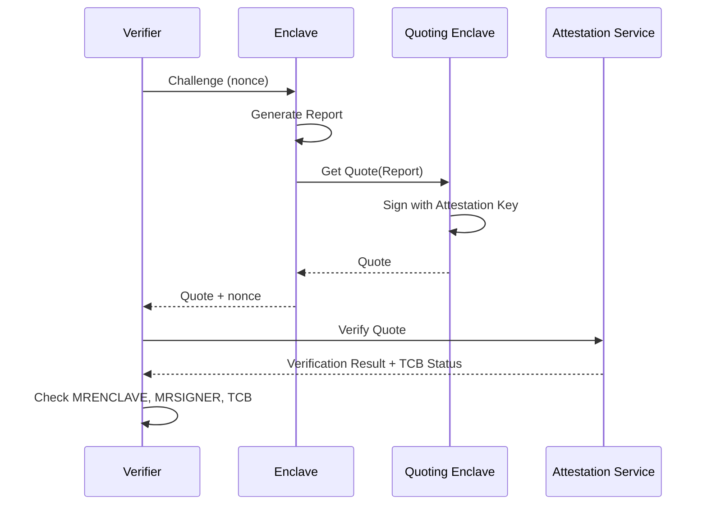
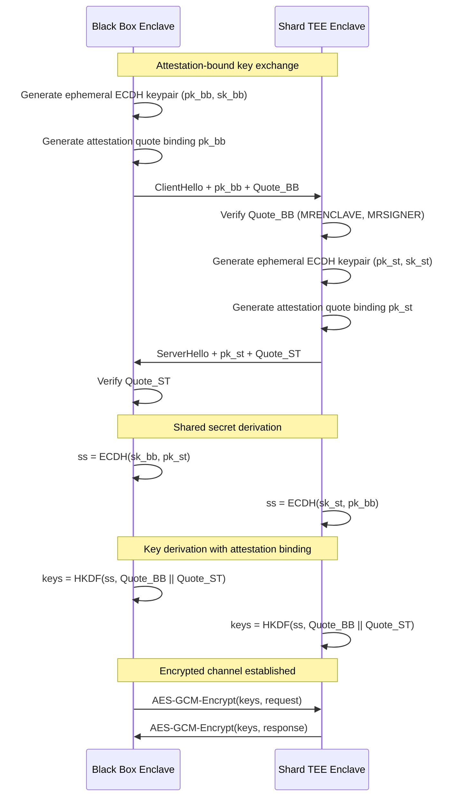
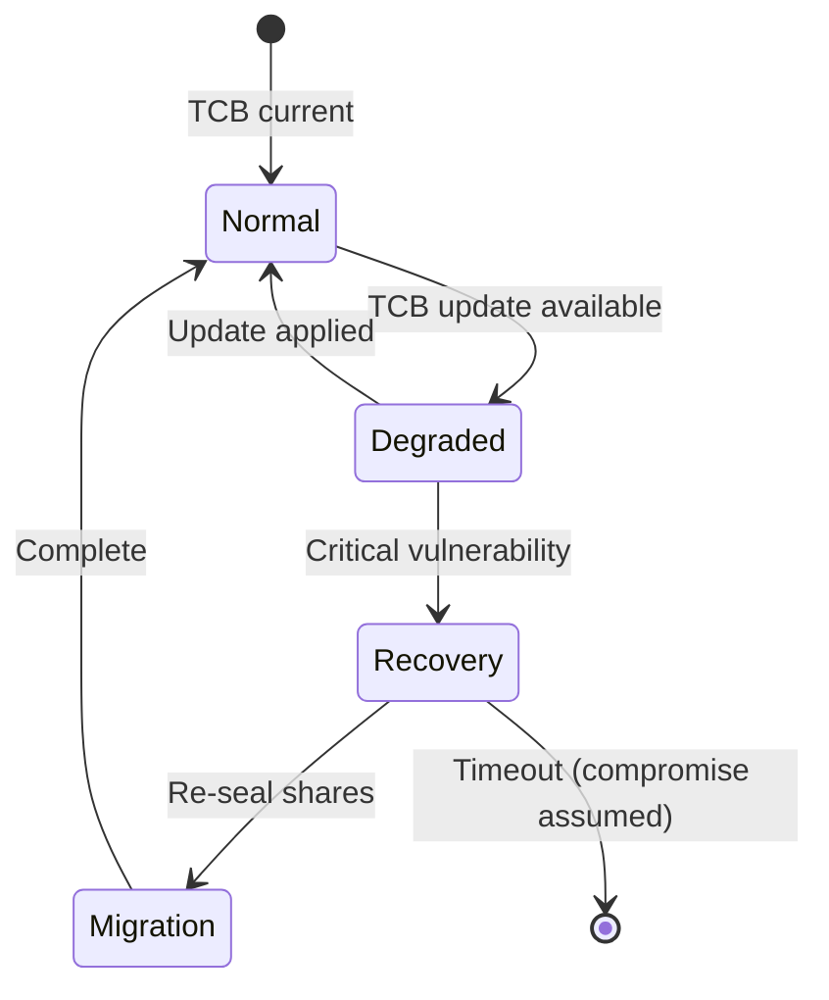

# CIFER Security — TEE Architecture Specification

> **Document Version:** 0.2  
> **Last Updated:** 2026-01-08  
> **Classification:** Technical Specification  
> **Target Audience:** Infrastructure Engineers, Security Researchers, Technical Due Diligence

---

## Table of Contents

1. [Introduction](#1-introduction)
2. [TEE Platform Selection](#2-tee-platform-selection)
3. [Enclave Architecture](#3-enclave-architecture)
4. [Remote Attestation](#4-remote-attestation)
5. [Secure Channel Establishment](#5-secure-channel-establishment)
6. [Sealing and Persistence](#6-sealing-and-persistence)
7. [Side-Channel Mitigations](#7-side-channel-mitigations)
8. [TCB Management](#8-tcb-management)
9. [Deployment Architecture](#9-deployment-architecture)
10. [Security Analysis](#10-security-analysis)
11. [References](#11-references)

---

## 1. Introduction

### 1.1 Purpose

This document specifies the Trusted Execution Environment (TEE) architecture for CIFER Security's zero-key encryption platform. TEEs provide hardware-enforced isolation for cryptographic operations, ensuring that key material is never exposed to the host operating system, hypervisor, or cloud provider.

### 1.2 TEE Role in CIFER

| Component | TEE Function |
|-----------|--------------|
| Black Box | Performs encryption, decryption, key derivation inside enclave |
| Shard TEEs | Store sealed key shares, release only to attested Black Box |
| Key Generation | ML-KEM-768 keypair generated inside enclave |

### 1.3 Security Objectives

| Objective | Description |
|-----------|-------------|
| **Confidentiality** | Key material never leaves TEE in plaintext |
| **Integrity** | Code execution is tamper-evident |
| **Attestation** | Remote parties can verify enclave identity |
| **Isolation** | Enclave memory inaccessible to host/hypervisor |

---

## 2. TEE Platform Selection

### 2.1 Supported Platforms

CIFER supports multiple TEE platforms for deployment flexibility and vendor diversity:

| Platform | Vendor | Security Level | Deployment |
|----------|--------|----------------|------------|
| **Intel SGX** | Intel | Hardware-based, ring-0 isolation | On-premise, Azure |
| **AMD SEV-SNP** | AMD | VM-level encryption + integrity | GCP, Azure, AWS |
| **ARM CCA** | ARM | Realms with hardware isolation | Future support |

### 2.2 Platform Comparison

```
Feature Comparison Matrix

                        | Intel SGX      | AMD SEV-SNP    | ARM CCA
------------------------|----------------|----------------|---------------
Isolation granularity   | Process        | VM             | Realm (VM)
Memory encryption       | MEE (128-bit)  | AES-128-XTS    | AES-128
Integrity protection    | Yes            | Yes (SNP)      | Yes
Max enclave memory      | 256GB (SGX2)   | VM size        | Realm size
Remote attestation      | DCAP/EPID      | SEV-SNP        | CCA
TCB updates             | Microcode      | Firmware       | Firmware
Side-channel hardening  | Partial        | Better         | Better
Cloud availability      | Azure, IBM     | GCP, Azure     | Future
```

### 2.3 Selection Criteria

```
select_tee_platform(deployment_context) → platform
    
    // Priority 1: Security requirements
    If require_process_isolation AND low_latency:
        Prefer SGX
    
    // Priority 2: Memory requirements
    If enclave_memory > 256GB:
        Prefer SEV-SNP
    
    // Priority 3: Cloud provider
    Match deployment_context.cloud_provider:
        "azure"  → SGX or SEV-SNP
        "gcp"    → SEV-SNP
        "aws"    → Nitro Enclaves (alternative) or SEV-SNP
    
    // Priority 4: Multi-vendor diversity
    For geographic distribution, use mix of platforms
```

---

## 3. Enclave Architecture

### 3.1 Black Box Enclave

The Black Box is the central trusted component that orchestrates cryptographic operations.

```
┌─────────────────────────────────────────────────────────────────┐
│                        Host System                               │
│  ┌───────────────────────────────────────────────────────────┐  │
│  │                    Black Box Enclave                       │  │
│  │  ┌─────────────┐  ┌─────────────┐  ┌─────────────────┐   │  │
│  │  │ Attestation │  │ Crypto Core │  │ Protocol Engine │   │  │
│  │  │   Module    │  │             │  │                 │   │  │
│  │  │             │  │ - ML-KEM    │  │ - CreateCIFER   │   │  │
│  │  │ - Generate  │  │ - AEAD      │  │ - Encrypt       │   │  │
│  │  │   Quote     │  │ - HKDF      │  │ - Decrypt       │   │  │
│  │  │ - Verify    │  │ - Shamir    │  │ - Rotate        │   │  │
│  │  │   Peer      │  │             │  │                 │   │  │
│  │  └─────────────┘  └─────────────┘  └─────────────────┘   │  │
│  │                                                            │  │
│  │  ┌─────────────────────────────────────────────────────┐  │  │
│  │  │              Secure Memory Region                    │  │  │
│  │  │  - Reconstructed dk (transient)                     │  │  │
│  │  │  - Shared secrets (transient)                       │  │  │
│  │  │  - Derived keys (transient)                         │  │  │
│  │  └─────────────────────────────────────────────────────┘  │  │
│  └───────────────────────────────────────────────────────────┘  │
│                              │                                   │
│                    ┌─────────┴─────────┐                        │
│                    │   Untrusted I/O   │                        │
│                    │   (encrypted)     │                        │
│                    └───────────────────┘                        │
└─────────────────────────────────────────────────────────────────┘
```

### 3.2 Shard TEE Enclave

Each shard TEE stores sealed key shares and enforces release policies.

```
┌─────────────────────────────────────────────────────────────────┐
│                     Shard TEE Enclave                            │
│  ┌─────────────┐  ┌─────────────────┐  ┌───────────────────┐   │
│  │ Attestation │  │ Share Storage   │  │ Policy Enforcer   │   │
│  │             │  │                 │  │                   │   │
│  │ - Verify    │  │ - Sealed shares │  │ - Verify caller   │   │
│  │   Black Box │  │ - CIFER index   │  │   attestation     │   │
│  │ - Generate  │  │                 │  │ - Check on-chain  │   │
│  │   Quote     │  │                 │  │   authorization   │   │
│  └─────────────┘  └─────────────────┘  └───────────────────┘   │
│                                                                  │
│  ┌─────────────────────────────────────────────────────────┐    │
│  │                    Sealed Storage                        │    │
│  │  ┌──────────────────────────────────────────────────┐   │    │
│  │  │ CIFER_001: share_1 (2400 bytes, sealed)          │   │    │
│  │  │ CIFER_002: share_1 (2400 bytes, sealed)          │   │    │
│  │  │ ...                                               │   │    │
│  │  └──────────────────────────────────────────────────┘   │    │
│  └─────────────────────────────────────────────────────────┘    │
└─────────────────────────────────────────────────────────────────┘
```

### 3.3 Enclave Entry Points (ECALLs)

```c
// Black Box Enclave API
sgx_status_t ecall_create_cifer(
    [out] uint8_t* ek,              // ML-KEM encapsulation key
    [out] size_t* ek_len,
    [out] uint8_t* cifer_id,        // Generated CIFER identifier
    [in] const uint8_t* owner_id,   // Owner identity
    size_t owner_id_len
);

sgx_status_t ecall_encrypt(
    [in] const uint8_t* cifer_id,
    [in] const uint8_t* ek,         // Encapsulation key from chain
    size_t ek_len,
    [in] const uint8_t* plaintext,
    size_t plaintext_len,
    [out] uint8_t* envelope,        // Output ciphertext envelope
    [out] size_t* envelope_len
);

sgx_status_t ecall_decrypt(
    [in] const uint8_t* cifer_id,
    [in] const uint8_t* envelope,
    size_t envelope_len,
    [in] const share_t* shares,     // Retrieved shares from shard TEEs
    size_t num_shares,
    [out] uint8_t* plaintext,
    [out] size_t* plaintext_len
);

// Shard TEE Enclave API
sgx_status_t ecall_store_share(
    [in] const uint8_t* cifer_id,
    [in] const uint8_t* share,
    size_t share_len,
    [in] const sgx_report_t* source_report  // Attestation from key generator
);

sgx_status_t ecall_retrieve_share(
    [in] const uint8_t* cifer_id,
    [in] const sgx_report_t* requester_report,  // Black Box attestation
    [in] const authorization_proof_t* auth,      // On-chain authorization
    [out] uint8_t* share,
    [out] size_t* share_len
);
```

### 3.4 Memory Layout

```
SGX Enclave Memory Layout:

0x0000_0000_0000 ┌─────────────────────────────┐
                 │        Guard Page           │  (unmapped)
                 ├─────────────────────────────┤
                 │     Enclave Code (.text)    │  RX
                 ├─────────────────────────────┤
                 │   Read-Only Data (.rodata)  │  R
                 ├─────────────────────────────┤
                 │     Global Data (.data)     │  RW
                 ├─────────────────────────────┤
                 │          BSS (.bss)         │  RW
                 ├─────────────────────────────┤
                 │         Heap Region         │  RW (encrypted)
                 │   - Transient key material  │
                 │   - Crypto state            │
                 ├─────────────────────────────┤
                 │        Stack Region         │  RW (encrypted)
                 ├─────────────────────────────┤
                 │      Thread Control         │  (TCS pages)
                 ├─────────────────────────────┤
                 │        Guard Page           │  (unmapped)
0xFFFF_FFFF_FFFF └─────────────────────────────┘

Memory Encryption: All enclave memory encrypted with MEE (SGX)
                   or AES-XTS (SEV-SNP)
```

---

## 4. Remote Attestation

### 4.1 Attestation Flow Overview

Remote attestation allows a verifier to confirm that an enclave is running expected code on genuine TEE hardware.



### 4.2 Intel SGX DCAP Attestation

```
SGX Quote Structure (DCAP):

+------------------+--------+----------------------------------------+
| Field            | Bytes  | Description                            |
+------------------+--------+----------------------------------------+
| version          | 2      | Quote version (3 for DCAP)             |
| att_key_type     | 2      | Attestation key algorithm (ECDSA-256)  |
| tee_type         | 4      | TEE type (0 = SGX)                     |
| reserved         | 4      | Reserved                               |
| qe_svn           | 2      | Quoting Enclave security version       |
| pce_svn          | 2      | Provisioning Cert Enclave SVN          |
| qe_vendor_id     | 16     | QE vendor UUID                         |
| user_data        | 20     | Application-defined data               |
| report_body      | 384    | REPORT structure (see below)           |
| signature_len    | 4      | Length of signature data               |
| signature_data   | var    | ECDSA signature + cert chain           |
+------------------+--------+----------------------------------------+

REPORT Body (embedded in Quote):

+------------------+--------+----------------------------------------+
| Field            | Bytes  | Description                            |
+------------------+--------+----------------------------------------+
| cpu_svn          | 16     | CPU security version                   |
| misc_select      | 4      | MISC_SELECT flags                      |
| reserved1        | 12     | Reserved                               |
| isv_ext_prod_id  | 16     | Extended product ID                    |
| attributes       | 16     | Enclave attributes (DEBUG, MODE64, etc)|
| MRENCLAVE        | 32     | SHA-256 of enclave code + data         |
| reserved2        | 32     | Reserved                               |
| MRSIGNER         | 32     | SHA-256 of signing key                 |
| reserved3        | 32     | Reserved                               |
| config_id        | 64     | Configuration ID                       |
| isv_prod_id      | 2      | ISV product ID                         |
| isv_svn          | 2      | ISV security version number            |
| config_svn       | 2      | Configuration SVN                      |
| reserved4        | 42     | Reserved                               |
| isv_family_id    | 16     | ISV family ID                          |
| report_data      | 64     | User-defined data (nonce, pubkey hash) |
+------------------+--------+----------------------------------------+
```

### 4.3 MRENCLAVE and MRSIGNER

| Measurement | Purpose | Binding |
|-------------|---------|---------|
| **MRENCLAVE** | Hash of enclave code + initial data | Specific build/version |
| **MRSIGNER** | Hash of signing key | Publisher identity |

```
CIFER Attestation Policy:

verify_enclave_identity(quote) → bool
    
    // Extract measurements
    mrenclave = quote.report_body.MRENCLAVE
    mrsigner = quote.report_body.MRSIGNER
    isv_svn = quote.report_body.isv_svn
    
    // Check against known-good values
    If mrenclave NOT IN trusted_mrenclave_list:
        Return false
    
    If mrsigner ≠ CIFER_SIGNING_KEY_HASH:
        Return false
    
    If isv_svn < MINIMUM_SVN:
        Return false  // Reject outdated versions
    
    // Verify attributes (no debug mode in production)
    If quote.report_body.attributes.DEBUG == 1:
        Return false
    
    Return true
```

### 4.4 AMD SEV-SNP Attestation

```
SEV-SNP Attestation Report:

+------------------+--------+----------------------------------------+
| Field            | Bytes  | Description                            |
+------------------+--------+----------------------------------------+
| version          | 4      | Report version                         |
| guest_svn        | 4      | Guest security version                 |
| policy           | 8      | Guest policy flags                     |
| family_id        | 16     | Family ID                              |
| image_id         | 16     | Image ID                               |
| vmpl             | 4      | Virtual Machine Privilege Level        |
| signature_algo   | 4      | Signature algorithm                    |
| platform_version | 8      | TCB version                            |
| platform_info    | 8      | Platform info flags                    |
| author_key_en    | 4      | Author key enabled                     |
| reserved1        | 28     | Reserved                               |
| report_data      | 64     | User-defined data                      |
| measurement      | 48     | Launch measurement (SHA-384)           |
| host_data        | 32     | Host-provided data                     |
| id_key_digest    | 48     | ID key digest                          |
| author_key_digest| 48     | Author key digest                      |
| report_id        | 32     | Report ID                              |
| report_id_ma     | 32     | Migration agent report ID              |
| reported_tcb     | 8      | Reported TCB                           |
| reserved2        | 24     | Reserved                               |
| chip_id          | 64     | Chip unique ID                         |
| committed_tcb    | 8      | Committed TCB                          |
| current_build    | 1      | Current build number                   |
| current_minor    | 1      | Current minor version                  |
| current_major    | 1      | Current major version                  |
| reserved3        | 1      | Reserved                               |
| committed_build  | 1      | Committed build                        |
| committed_minor  | 1      | Committed minor                        |
| committed_major  | 1      | Committed major                        |
| reserved4        | 1      | Reserved                               |
| launch_tcb       | 8      | Launch TCB                             |
| reserved5        | 168    | Reserved                               |
| signature        | 512    | ECDSA signature                        |
+------------------+--------+----------------------------------------+
```

### 4.5 Cross-Platform Attestation

```
normalize_attestation(platform, quote) → unified_report
    
    Match platform:
        SGX:
            Return {
                measurement: quote.report_body.MRENCLAVE,
                signer: quote.report_body.MRSIGNER,
                version: quote.report_body.isv_svn,
                debug: quote.report_body.attributes.DEBUG,
                user_data: quote.report_body.report_data,
                tcb_status: verify_tcb_sgx(quote),
                platform: "sgx"
            }
        
        SEV_SNP:
            Return {
                measurement: quote.measurement,
                signer: quote.author_key_digest,
                version: quote.guest_svn,
                debug: (quote.policy & DEBUG_MASK) != 0,
                user_data: quote.report_data,
                tcb_status: verify_tcb_sev(quote),
                platform: "sev-snp"
            }
```

---

## 5. Secure Channel Establishment

### 5.1 Enclave-to-Enclave Channel

Secure channels between Black Box and Shard TEEs use mutually authenticated TLS with attestation binding.



### 5.2 Channel Key Derivation

```
derive_channel_keys(ecdh_shared_secret, quote_bb, quote_st) → (enc_key, mac_key)
    
    // Construct transcript binding
    transcript = "CIFER-channel-v1"
               || quote_bb.report_body.MRENCLAVE
               || quote_bb.report_body.report_data[:32]  // Contains pk_bb hash
               || quote_st.report_body.MRENCLAVE
               || quote_st.report_body.report_data[:32]  // Contains pk_st hash
    
    // Extract PRK
    salt = SHA-384(transcript)[:32]
    PRK = HKDF-Extract(salt, ecdh_shared_secret)
    
    // Expand to encryption and MAC keys
    enc_key = HKDF-Expand(PRK, "encryption", 32)
    mac_key = HKDF-Expand(PRK, "mac", 32)
    
    Return (enc_key, mac_key)
```

### 5.3 Session Management

```
Channel Session Structure:

session {
    session_id:     bytes[16]      // Random session identifier
    peer_mrenclave: bytes[32]      // Verified peer measurement
    peer_mrsigner:  bytes[32]      // Verified peer signer
    enc_key:        bytes[32]      // AES-256-GCM key
    mac_key:        bytes[32]      // HMAC key (for additional MAC if needed)
    send_counter:   uint64         // Nonce counter (send direction)
    recv_counter:   uint64         // Nonce counter (receive direction)
    created_at:     timestamp      // Session creation time
    expires_at:     timestamp      // Session expiration (max 1 hour)
}
```

---

## 6. Sealing and Persistence

### 6.1 Sealing Overview

Sealing encrypts data so only the same enclave (or authorized enclaves) can unseal it.

```
seal(plaintext, policy) → sealed_data
    
    // Derive sealing key based on policy
    Match policy:
        MRENCLAVE:
            // Only this exact enclave code can unseal
            seal_key = derive_seal_key(MRENCLAVE, key_id)
        
        MRSIGNER:
            // Any enclave from same signer can unseal
            seal_key = derive_seal_key(MRSIGNER, key_id)
    
    // Encrypt with authenticated encryption
    nonce = random(12)
    aad = policy || MRENCLAVE || timestamp
    ciphertext = AES-256-GCM.Encrypt(seal_key, nonce, plaintext, aad)
    
    Return {
        policy: policy,
        nonce: nonce,
        aad: aad,
        ciphertext: ciphertext
    }
```

### 6.2 Shard Storage Format

```
Sealed Share Storage Format:

+------------------+--------+----------------------------------------+
| Field            | Bytes  | Description                            |
+------------------+--------+----------------------------------------+
| magic            | 4      | "SEAL" (0x5345414C)                    |
| version          | 2      | Seal format version                    |
| seal_policy      | 2      | MRENCLAVE (0x01) or MRSIGNER (0x02)    |
| cifer_id         | 32     | CIFER identifier                       |
| shard_index      | 2      | Shard index (1-5)                      |
| created_at       | 8      | Unix timestamp                         |
| key_version      | 4      | Key rotation version                   |
| mrenclave        | 32     | Enclave that created seal              |
| nonce            | 12     | AES-GCM nonce                          |
| aad_len          | 4      | AAD length                             |
| aad              | var    | Additional authenticated data          |
| ciphertext_len   | 4      | Ciphertext length                      |
| ciphertext       | var    | Encrypted share + GCM tag              |
+------------------+--------+----------------------------------------+
```

### 6.3 Seal Key Derivation (SGX)

```
SGX Seal Key Derivation:

EGETKEY(KEY_REQUEST) → seal_key

KEY_REQUEST {
    key_name:        SEAL_KEY (0x0004)
    key_policy:      MRENCLAVE | MRSIGNER
    isv_svn:         current SVN
    cpu_svn:         current CPU SVN
    attribute_mask:  ~(DEBUG | RESERVED)
    key_id:          random(32)  // Per-seal unique
    misc_mask:       0
}

// Hardware derives key from:
// - CPU root key (fused in hardware)
// - MRENCLAVE or MRSIGNER (depending on policy)
// - Key ID
// - SVN values
```

### 6.4 TCB Recovery Sealing

To allow unsealing after TCB updates:

```
seal_with_tcb_recovery(share, cifer_id) → sealed_data
    
    // Seal with MRSIGNER policy (allows SVN upgrades)
    primary_seal = seal(share, policy=MRSIGNER)
    
    // Create recovery seal at lower SVN (emergency recovery)
    recovery_seal = seal(share, policy=MRSIGNER, target_svn=min_supported_svn)
    
    Return {
        primary: primary_seal,
        recovery: recovery_seal,
        min_svn: min_supported_svn
    }
```

---

## 7. Side-Channel Mitigations

### 7.1 Threat Classification

| Attack Class | Description | Mitigation Status |
|--------------|-------------|-------------------|
| **Spectre v1** | Bounds check bypass | Compiler barriers + LFENCE |
| **Spectre v2** | Branch target injection | Retpoline + IBRS |
| **Meltdown** | Rogue data cache load | Kernel patches (KPTI) |
| **L1TF** | L1 Terminal Fault | Microcode + flush |
| **MDS** | Microarchitectural Data Sampling | Microcode + VERW |
| **Cache timing** | AES T-table attacks | AES-NI (constant-time) |
| **Controlled channel** | Page fault patterns | ORAM / constant-time |

### 7.2 Implementation Guidelines

```c
// 1. Memory access patterns must be data-independent
// BAD: Secret-dependent branch
if (secret_bit) {
    access(table_a);
} else {
    access(table_b);
}

// GOOD: Constant-time select
uint8_t mask = -(uint8_t)secret_bit;  // 0xFF if 1, 0x00 if 0
result = (table_a & mask) | (table_b & ~mask);

// 2. Use AES-NI for constant-time AES
// Never use T-table implementations inside enclave

// 3. Speculation barriers after bounds checks
if (index < array_len) {
    __asm__ __volatile__("lfence" ::: "memory");
    value = array[index];
}

// 4. Clear registers/stack after use
void secure_function() {
    uint8_t secret_buffer[32];
    // ... use secret_buffer ...
    
    // Explicit clearing
    volatile uint8_t *p = secret_buffer;
    for (int i = 0; i < 32; i++) p[i] = 0;
    __asm__ __volatile__("" ::: "memory");
}
```

### 7.3 Platform-Specific Mitigations

```
SGX Side-Channel Mitigations:

1. Enable SSBD (Speculative Store Bypass Disable)
   - Set IA32_SPEC_CTRL.SSBD = 1

2. Enable IBRS (Indirect Branch Restricted Speculation)
   - Set IA32_SPEC_CTRL.IBRS = 1

3. Use VERW instruction before EEXIT
   - Clears microarchitectural buffers

4. Configure enclave with:
   - Disable hyperthreading (or use core isolation)
   - Set appropriate XFRM for extended state

SEV-SNP Side-Channel Mitigations:

1. Enable SME (Secure Memory Encryption)
2. Use SEV-ES (Encrypted State) for register protection
3. SNP provides integrity protection against replay
```

### 7.4 Constant-Time Crypto Verification

```
verify_constant_time_implementation(function) → report
    
    // 1. Static analysis
    Run TIMECOP or ct-verif on function
    Check for secret-dependent branches
    Check for secret-dependent memory access
    
    // 2. Dynamic analysis
    For many random inputs:
        Measure execution time with high precision
        Record cache state changes (perf counters)
    
    // 3. Statistical analysis
    Compute timing variance across inputs
    If variance > threshold:
        Flag potential timing leak
    
    // 4. Dudect testing
    Run dudect on function with secret inputs
    Check for distinguishable timing distributions
```

---

## 8. TCB Management

### 8.1 Trusted Computing Base Components

| Component | Version Control | Update Mechanism |
|-----------|-----------------|------------------|
| CPU microcode | SVN (Security Version Number) | BIOS update |
| Platform firmware | SVN | OEM update |
| SGX PSW/SDK | Version + SVN | Package update |
| Quoting Enclave | QESVN | Intel update |
| CIFER Enclave | ISV_SVN | CIFER release |

### 8.2 TCB Recovery Process



### 8.3 Enclave Update Procedure

```
update_enclave(old_version, new_version) → success
    
    // 1. Deploy new enclave version (higher ISV_SVN)
    deploy(new_enclave_binary)
    
    // 2. Verify new enclave attestation
    new_quote = get_attestation(new_enclave)
    verify_signature(new_quote)
    Assert new_quote.isv_svn > old_version.isv_svn
    
    // 3. Migrate sealed data (if using MRSIGNER policy)
    // Old enclave unseals, new enclave reseals
    For each sealed_share:
        plaintext = old_enclave.unseal(sealed_share)
        new_sealed = new_enclave.seal(plaintext)
        store(new_sealed)
    
    // 4. Update attestation policy
    add_to_trusted_mrenclave(new_quote.mrenclave)
    
    // 5. Graceful deprecation of old version
    set_deprecation_deadline(old_version, days=30)
    After deadline:
        remove_from_trusted_mrenclave(old_mrenclave)
```

### 8.4 TCB Status Levels

```
TCB Status (from attestation verification):

+------------------+------------------------------------------------+
| Status           | Action                                         |
+------------------+------------------------------------------------+
| UP_TO_DATE       | Normal operation                               |
| SW_HARDENING_NEEDED | Accept, schedule update                     |
| CONFIGURATION_NEEDED | Accept with reduced trust, schedule config |
| OUT_OF_DATE      | Reject or accept with warnings                 |
| OUT_OF_DATE_CONFIG | Reject new sessions, allow existing          |
| REVOKED          | Reject all operations                          |
+------------------+------------------------------------------------+
```

---

## 9. Deployment Architecture

### 9.1 Geographic Distribution

```
┌────────────────────────────────────────────────────────────────────┐
│                       Global TEE Network                            │
│                                                                     │
│  ┌──────────────┐    ┌──────────────┐    ┌──────────────┐         │
│  │  Region: US  │    │  Region: EU  │    │ Region: APAC │         │
│  │              │    │              │    │              │         │
│  │ ┌──────────┐ │    │ ┌──────────┐ │    │ ┌──────────┐ │         │
│  │ │Shard TEE │ │    │ │Shard TEE │ │    │ │Shard TEE │ │         │
│  │ │    #1    │ │    │ │    #2    │ │    │ │    #3    │ │         │
│  │ │ (Azure)  │ │    │ │  (GCP)   │ │    │ │ (Azure)  │ │         │
│  │ └──────────┘ │    │ └──────────┘ │    │ └──────────┘ │         │
│  │              │    │              │    │              │         │
│  │ ┌──────────┐ │    │ ┌──────────┐ │    │              │         │
│  │ │Shard TEE │ │    │ │Shard TEE │ │    │              │         │
│  │ │    #4    │ │    │ │    #5    │ │    │              │         │
│  │ │  (AWS*)  │ │    │ │(On-prem) │ │    │              │         │
│  │ └──────────┘ │    │ └──────────┘ │    │              │         │
│  └──────────────┘    └──────────────┘    └──────────────┘         │
│                                                                     │
│  * AWS Nitro Enclaves with SEV-SNP or alternative attestation      │
└────────────────────────────────────────────────────────────────────┘
```

### 9.2 High Availability Configuration

```
TEE Deployment Requirements:

Per Shard TEE:
    - Primary instance (active)
    - Standby instance (warm, same sealed data)
    - Different availability zone from other shards

Network:
    - Dedicated VPN mesh between TEE hosts
    - mTLS with certificate pinning
    - DDoS protection at edge

Storage:
    - Sealed shares replicated to standby
    - Encrypted backup to cold storage
    - Geographic separation of backups

Monitoring:
    - Health checks every 10 seconds
    - Attestation refresh every 1 hour
    - Alert on TCB status change
```

### 9.3 Failover Procedure

```
handle_shard_failure(failed_shard_id) → recovery_status
    
    // 1. Detect failure
    failure_confirmed = consecutive_health_check_failures >= 3
    
    // 2. Assess impact
    remaining_shards = active_shards - {failed_shard_id}
    If len(remaining_shards) >= t:
        // System remains operational
        log("Degraded mode: %d shards available", len(remaining_shards))
    Else:
        // Critical: decrypt operations blocked
        alert_critical("Below threshold: only %d shards", len(remaining_shards))
    
    // 3. Activate standby
    standby = get_standby(failed_shard_id)
    If standby.attestation_valid():
        promote_to_primary(standby)
        update_routing(failed_shard_id → standby)
    
    // 4. Provision replacement
    new_shard = provision_tee_instance(
        region = failed_shard.region,
        platform = failed_shard.platform
    )
    
    // 5. Re-share if needed (requires owner authorization for each CIFER)
    // This is a manual recovery procedure triggered by security team
```

---

## 10. Security Analysis

### 10.1 Trust Boundaries

```
┌─────────────────────────────────────────────────────────────────┐
│                        Trust Level 0                             │
│                   (Hardware Root of Trust)                       │
│  ┌────────────────────────────────────────────────────────────┐ │
│  │                     CPU Package                             │ │
│  │  - Attestation keys fused in silicon                       │ │
│  │  - Memory encryption engine                                │ │
│  │  - Microcode (updatable but attested)                      │ │
│  └────────────────────────────────────────────────────────────┘ │
└─────────────────────────────────────────────────────────────────┘
                              │
                              ▼
┌─────────────────────────────────────────────────────────────────┐
│                        Trust Level 1                             │
│                       (TEE Enclave)                              │
│  ┌────────────────────────────────────────────────────────────┐ │
│  │                   CIFER Enclave Code                        │ │
│  │  - Open source, audited                                    │ │
│  │  - Deterministic build (reproducible)                      │ │
│  │  - Measured (MRENCLAVE)                                    │ │
│  └────────────────────────────────────────────────────────────┘ │
└─────────────────────────────────────────────────────────────────┘
                              │
                              ▼
┌─────────────────────────────────────────────────────────────────┐
│                        Trust Level 2                             │
│                    (Authenticated Input)                         │
│  - Blockchain state (tamper-evident)                            │
│  - Attested peer reports                                        │
│  - Owner signatures                                             │
└─────────────────────────────────────────────────────────────────┘
                              │
                              ▼
┌─────────────────────────────────────────────────────────────────┐
│                        Untrusted                                 │
│  - Host OS / hypervisor                                         │
│  - Network transport                                            │
│  - Cloud provider infrastructure                                │
│  - CIFER operators (no access to keys)                          │
└─────────────────────────────────────────────────────────────────┘
```

### 10.2 Attack Surface Analysis

| Attack Vector | Impact | Mitigation | Residual Risk |
|---------------|--------|------------|---------------|
| Malicious host OS | High | TEE isolation | TEE bugs |
| Compromised shard TEE (< t) | None | Threshold sharing | N/A |
| Compromised shard TEEs (≥ t) | Critical | Geographic + vendor diversity | Coordinated attack |
| Side-channel (single TEE) | Medium | Constant-time + mitigations | Unknown side-channels |
| Attestation service compromise | High | Multiple verification paths | Single point of failure |
| Supply chain (hardware) | Critical | Multi-vendor strategy | Nation-state level |

### 10.3 TEE Platform Risk Assessment

```
Risk Matrix by Platform:

                    │ Known Vulnerabilities │ Patch Cadence │ Research Scrutiny
────────────────────┼───────────────────────┼───────────────┼──────────────────
Intel SGX           │ High (well-studied)   │ Monthly       │ Very High
AMD SEV-SNP         │ Medium (newer)        │ Quarterly     │ High
ARM CCA             │ Low (very new)        │ TBD           │ Medium

Risk Mitigation:
1. Deploy across multiple platforms (vendor diversity)
2. Require t > 1 shares from each platform category
3. Monitor CVE databases for TEE vulnerabilities
4. Maintain emergency re-keying procedure
```

### 10.4 Formal Security Properties

The TEE architecture provides:

| Property | Guarantee | Assumption |
|----------|-----------|------------|
| **Key confidentiality** | dk never leaves TEE in plaintext | TEE isolation holds |
| **Share confidentiality** | < t shares reveal nothing | Shamir security |
| **Attestation authenticity** | Quote unforgeable | Attestation key secure |
| **Forward secrecy** | Past sessions secure after key compromise | Ephemeral ECDH |
| **Operator zero-knowledge** | Operators cannot access user data | TEE + crypto correct |

---

## 11. References

### TEE Platform Documentation

1. **Intel SGX Developer Reference** — Intel, 2023
2. **Intel SGX DCAP Attestation** — Intel, 2023
3. **AMD SEV-SNP API Specification** — AMD, 2023
4. **ARM Confidential Compute Architecture** — ARM, 2023

### Security Research

5. **SGXAxe: Practical Enclave Extraction** — USENIX Security 2020
6. **Plundervolt: Software-based Fault Injection** — IEEE S&P 2020
7. **SEVerity: Code Injection Attacks against AMD SEV** — USENIX Security 2021
8. **A Survey on Intel SGX Security** — ACM Computing Surveys, 2022

### Standards

9. **NIST SP 800-123** — Guide to General Server Security
10. **TCG TPM 2.0 Library Specification** — Trusted Computing Group

---

## Appendix A: Enclave Build Reproducibility

```
Reproducible Build Process:

1. Pin toolchain versions:
   - GCC/Clang version: X.Y.Z
   - SGX SDK version: A.B.C
   - Linker version: P.Q.R

2. Deterministic build environment:
   $ docker run --rm -v $(pwd):/build \
       cifer/enclave-builder:v1.0.0 \
       make REPRODUCIBLE=1

3. Verify MRENCLAVE:
   $ sgx_sign dump -enclave build/cifer_enclave.signed.so -dumpfile dump.txt
   $ grep MRENCLAVE dump.txt
   MRENCLAVE: 0x1234567890abcdef...

4. Publish expected measurements:
   - MRENCLAVE: <hash>
   - MRSIGNER: <hash>
   - ISV_SVN: <version>
   - Build command: <reproducible command>
```

---

## Appendix B: Emergency Procedures

### B.1 TEE Compromise Response

```
emergency_tee_compromise(compromised_tee_ids) → response
    
    // 1. Immediate isolation
    For each tee_id in compromised_tee_ids:
        revoke_network_access(tee_id)
        remove_from_attestation_whitelist(tee_id.mrenclave)
    
    // 2. Assess impact
    affected_cifers = get_cifers_with_shares_on(compromised_tee_ids)
    compromised_cifers = []
    
    For each cifer in affected_cifers:
        compromised_share_count = count_shares_on(cifer, compromised_tee_ids)
        If compromised_share_count >= t:
            compromised_cifers.append(cifer)
    
    // 3. Notify affected users
    For each cifer in compromised_cifers:
        notify_owner(cifer, "Key compromise - initiate re-encryption")
    
    // 4. Force key rotation for affected CIFERs
    For each cifer in affected_cifers:
        If cifer NOT IN compromised_cifers:
            rotate_key(cifer)  // Proactive rotation
    
    // 5. Post-incident
    conduct_forensics(compromised_tee_ids)
    update_threat_model()
    improve_monitoring()
```


