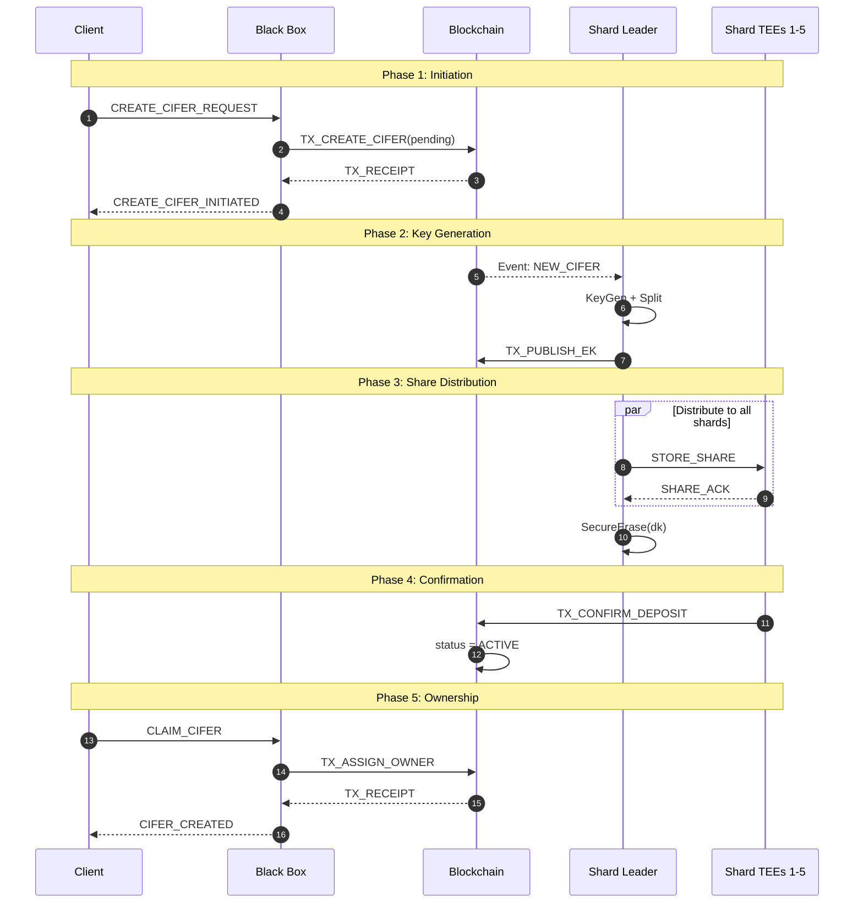
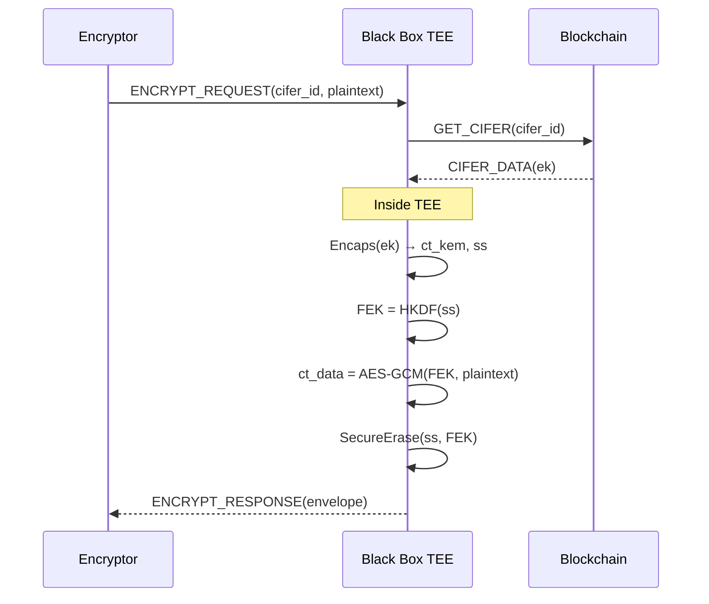
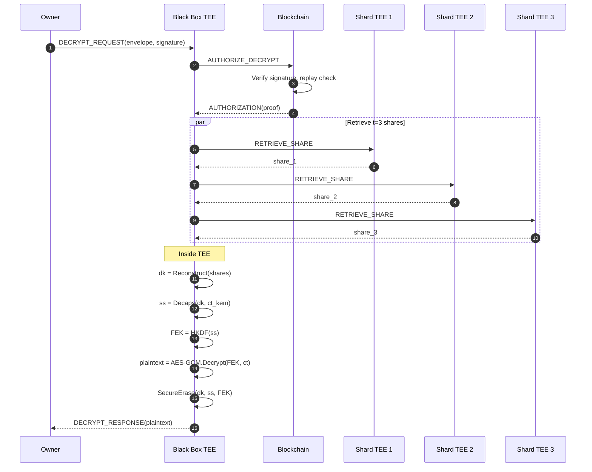
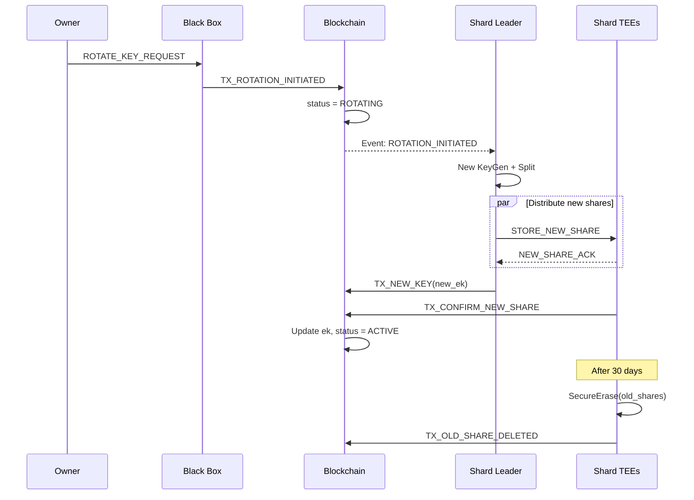
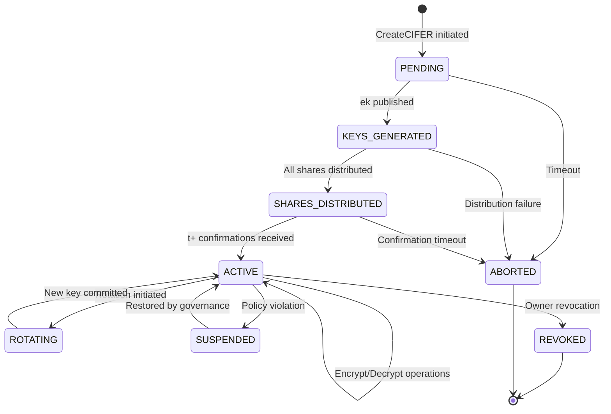

# CIFER Security — Protocol Specification

> **Document Version:** 0.2  
> **Last Updated:** 2026-01-08  
> **Classification:** Technical Specification  
> **Target Audience:** Protocol Engineers, Security Auditors, Implementation Teams

---

## Table of Contents

1. [Introduction](#1-introduction)
2. [Notation and Conventions](#2-notation-and-conventions)
3. [Protocol Participants](#3-protocol-participants)
4. [Protocol 1: CIFER Creation](#4-protocol-1-cifer-creation)
5. [Protocol 2: Encryption](#5-protocol-2-encryption)
6. [Protocol 3: Decryption](#6-protocol-3-decryption)
7. [Protocol 4: Key Rotation](#7-protocol-4-key-rotation)
8. [Message Formats](#8-message-formats)
9. [State Machines](#9-state-machines)
10. [Error Handling](#10-error-handling)
11. [Security Considerations](#11-security-considerations)
12. [References](#12-references)

---

## 1. Introduction

### 1.1 Purpose

This document provides the formal protocol specification for CIFER Security's zero-key encryption system. It defines the message flows, state transitions, and security requirements for all protocol interactions.

### 1.2 Scope

| Protocol | Description |
|----------|-------------|
| CIFER Creation | Establish new encryption identity with distributed key shares |
| Encryption | Encrypt data to a CIFER recipient |
| Decryption | Authorized recovery of plaintext |
| Key Rotation | Replace key material while maintaining identity |

### 1.3 Design Goals

1. **Correctness:** Authorized decryption always succeeds
2. **Soundness:** Unauthorized parties cannot decrypt
3. **Liveness:** Protocol completes in bounded time
4. **Privacy:** No information leakage beyond authorized access

---

## 2. Notation and Conventions

### 2.1 Cryptographic Notation

| Symbol | Meaning |
|--------|---------|
| \( A \rightarrow B: M \) | Party A sends message M to party B |
| \( \{M\}_K \) | Message M encrypted under key K |
| \( \text{sig}_K(M) \) | Signature on M using key K |
| \( H(x) \) | Cryptographic hash of x |
| \( x \leftarrow_\$ S \) | Sample x uniformly from set S |
| \( [n] \) | Set {1, 2, ..., n} |
| \( \bot \) | Error/failure symbol |

### 2.2 Protocol Notation

```
Protocol P:
    Participants: A, B, C
    Inputs: 
        A: input_a
        B: input_b
    
    Round 1:
        A computes: x = f(input_a)
        A → B: MSG_TYPE(field1, field2, ...)
    
    Round 2:
        B verifies: condition
        B computes: y = g(x, input_b)
        B → A: RESPONSE(result)
    
    Outputs:
        A: output_a
        B: output_b
```

### 2.3 Message Encoding

All messages use the following encoding conventions:

| Type | Encoding | Size |
|------|----------|------|
| uint8 | Unsigned 8-bit integer | 1 byte |
| uint16 | Big-endian unsigned 16-bit | 2 bytes |
| uint32 | Big-endian unsigned 32-bit | 4 bytes |
| uint64 | Big-endian unsigned 64-bit | 8 bytes |
| bytes[n] | Fixed-length byte array | n bytes |
| varlen | Length-prefixed (uint32 + data) | 4 + len bytes |
| timestamp | Unix epoch in milliseconds (uint64) | 8 bytes |

---

## 3. Protocol Participants

### 3.1 Participant Definitions

| Participant | Notation | Description |
|-------------|----------|-------------|
| Client | C | User or application initiating requests |
| Black Box | BB | TEE enclave performing crypto operations |
| Blockchain | BC | Permission and state management chain |
| Shard TEE Leader | SL | TEE that generates keys and distributes shares |
| Shard TEE i | S_i | TEE storing key share i |

### 3.2 Trust Assumptions

```
Trust Model:

C (Client):
    - Trusted for own data
    - May be malicious toward other users
    - Authentication via owner_id

BB (Black Box):
    - Trusted (TEE-enforced)
    - Open-source, attested
    - Stateless (no persistent secrets)

BC (Blockchain):
    - Trusted for integrity (tamper-evident)
    - Public (no confidentiality)
    - Byzantine fault tolerant

S_i (Shard TEEs):
    - Trusted individually (TEE-enforced)
    - At most (t-1) may be compromised
    - Geographically distributed
```

### 3.3 Communication Channels

| Channel | Security | Authentication |
|---------|----------|----------------|
| C ↔ BB | TLS 1.3 | Client certificate or OAuth |
| BB ↔ BC | TLS 1.3 | BB enclave signature |
| BB ↔ S_i | Attested TLS | Mutual TEE attestation |
| S_i ↔ S_j | Attested TLS | Mutual TEE attestation |
| SL ↔ BC | TLS 1.3 | SL enclave signature |

---

## 4. Protocol 1: CIFER Creation

### 4.1 Overview

The CIFER Creation protocol establishes a new encryption identity with ML-KEM-768 key material distributed across shard TEEs.

### 4.2 Formal Specification

```
Protocol CreateCIFER:

Participants: C (Client), BB (Black Box), BC (Blockchain), 
              SL (Shard Leader), S_1..S_n (Shard TEEs)

Parameters:
    n = 5       // Total shards
    t = 3       // Reconstruction threshold

Inputs:
    C: owner_id, policy_params (optional)
    
Phase 1 - Initiation:
    1.1  C → BB: CREATE_CIFER_REQUEST(owner_id, policy_params, nonce_c)
    1.2  BB verifies: authenticate(owner_id)
    1.3  BB generates: cifer_id ←$ {0,1}^256
    1.4  BB → BC: TX_CREATE_CIFER(cifer_id, status=PENDING)
    1.5  BC verifies: cifer_id not exists
    1.6  BC commits: CIFER_RECORD(cifer_id, status=PENDING, created_at=now)
    1.7  BC → BB: TX_RECEIPT(tx_hash, block_height)
    1.8  BB → C: CREATE_CIFER_INITIATED(cifer_id, tx_hash)

Phase 2 - Key Generation:
    2.1  SL observes: BC event NEW_CIFER(cifer_id)
    2.2  SL computes inside TEE:
         (ek, dk) ← ML-KEM-768.KeyGen()
         shares[1..n] ← Shamir.Split(dk, n, t)
    2.3  SL → BC: TX_PUBLISH_EK(cifer_id, ek)
    2.4  BC verifies: cifer_id.status == PENDING
    2.5  BC commits: CIFER_RECORD.ek = ek

Phase 3 - Share Distribution:
    For i in [1, n]:
        3.1  SL establishes attested channel to S_i
        3.2  SL → S_i: STORE_SHARE(cifer_id, share[i], attestation_SL)
        3.3  S_i verifies: verify_attestation(attestation_SL)
        3.4  S_i computes: sealed_share = Seal(share[i], cifer_id, MRENCLAVE)
        3.5  S_i stores: DB[cifer_id] = sealed_share
        3.6  S_i → SL: SHARE_ACK(cifer_id, shard_id=i, signature_Si)
    
    3.7  SL verifies: received all n ACKs
    3.8  SL erases: SecureErase(dk, shares)

Phase 4 - Confirmation:
    4.1  For i in [1, n]:
         S_i → BC: TX_CONFIRM_DEPOSIT(cifer_id, shard_id=i, commitment_i)
    4.2  BC verifies: count(confirmations) >= t
    4.3  BC commits: CIFER_RECORD.status = ACTIVE, shares_confirmed = [1..n]

Phase 5 - Ownership Assignment:
    5.1  C → BB: CLAIM_CIFER(cifer_id, owner_id, signature_owner)
    5.2  BB verifies: signature_owner valid for owner_id
    5.3  BB → BC: TX_ASSIGN_OWNER(cifer_id, owner_id)
    5.4  BC verifies: cifer_id.status == ACTIVE, owner not set
    5.5  BC commits: CIFER_RECORD.owner = owner_id
    5.6  BC → BB: TX_RECEIPT(tx_hash)
    5.7  BB → C: CIFER_CREATED(cifer_id, ek, tx_hash)

Outputs:
    C: cifer_id, ek (encapsulation key)
    BC: CIFER_RECORD(cifer_id, owner_id, ek, status=ACTIVE)
    S_i: sealed_share[i] for cifer_id

Security Properties:
    - dk never exists in complete form outside TEE
    - Each S_i holds exactly one share (< 30% of key material)
    - owner_id binding is on-chain and immutable
```

### 4.3 Sequence Diagram



### 4.4 Timing Constraints

| Phase | Max Duration | Timeout Action |
|-------|--------------|----------------|
| 1 (Initiation) | 30 seconds | Retry |
| 2 (KeyGen) | 60 seconds | Alert, manual intervention |
| 3 (Distribution) | 120 seconds | Abort, cleanup |
| 4 (Confirmation) | 300 seconds | Retry confirmations |
| 5 (Ownership) | 30 seconds | Retry |
| **Total** | **540 seconds** | Full abort and cleanup |

---

## 5. Protocol 2: Encryption

### 5.1 Overview

The Encryption protocol allows any party to encrypt data for a CIFER recipient. No authorization is required to encrypt.

### 5.2 Formal Specification

```
Protocol Encrypt:

Participants: E (Encryptor), BB (Black Box), BC (Blockchain)

Inputs:
    E: recipient_cifer_id, plaintext, metadata (optional)

Round 1 - Request:
    1.1  E → BB: ENCRYPT_REQUEST(
             recipient_cifer_id,
             plaintext,
             metadata,
             nonce_e
         )

Round 2 - Key Retrieval:
    2.1  BB → BC: GET_CIFER(recipient_cifer_id)
    2.2  BC verifies: cifer exists AND status == ACTIVE
    2.3  BC → BB: CIFER_DATA(cifer_id, ek, owner_id, policy)
    2.4  BB verifies: ek is valid ML-KEM-768 encapsulation key

Round 3 - Encryption (inside TEE):
    3.1  BB computes:
         (ct_kem, ss) ← ML-KEM-768.Encaps(ek)
         salt ← SHA-384(CONTEXT_ENVELOPE || cifer_id)[:32]
         (FEK, _) ← HKDF(ss, salt, CONTEXT_KDF_FEK, 32)
         nonce ← random(12)
         aad ← construct_aad(version, kem_alg, aead_alg, cifer_id, timestamp, metadata)
         ct_data ← AES-256-GCM.Encrypt(FEK, nonce, plaintext, aad)
    
    3.2  BB constructs envelope:
         envelope = {
             magic: "CIFR",
             version: 0x0001,
             flags: 0x0000,
             cifer_id: recipient_cifer_id,
             kem_algorithm: ML_KEM_768,
             ct_kem: ct_kem,
             aead_algorithm: AES_256_GCM,
             nonce: nonce,
             aad: aad,
             ct_data: ct_data
         }
    
    3.3  BB erases: SecureErase(ss, FEK)

Round 4 - Response:
    4.1  BB → E: ENCRYPT_RESPONSE(envelope, nonce_e)

Outputs:
    E: envelope (encrypted data)

Security Properties:
    - Forward secrecy: each encryption uses fresh KEM randomness
    - Confidentiality: only CIFER owner can decrypt
    - Integrity: AEAD tag prevents tampering
    - Binding: AAD binds cifer_id to ciphertext
```

### 5.3 Sequence Diagram



### 5.4 Encryption Modes

| Mode | Use Case | Configuration |
|------|----------|---------------|
| **Standard** | Files < 1 GB | Single envelope |
| **Chunked** | Files > 1 GB | Multiple envelopes with sequence |
| **Streaming** | Real-time data | Continuous envelope generation |

```
Chunked Encryption:

For files larger than CHUNK_SIZE (64 MB):

1. Split plaintext into chunks: P_1, P_2, ..., P_m
2. Generate master KEM operation: (ct_kem, ss)
3. For each chunk i:
   FEK_i = HKDF(ss, salt, "chunk" || i, 32)
   ct_i = AES-GCM(FEK_i, nonce_i, P_i, aad_i)
4. Envelope includes:
   - ct_kem (once)
   - Sequence of (chunk_index, nonce_i, ct_i)
```

---

## 6. Protocol 3: Decryption

### 6.1 Overview

The Decryption protocol recovers plaintext from an encrypted envelope. Only authorized parties (default: CIFER owner) can decrypt.

### 6.2 Formal Specification

```
Protocol Decrypt:

Participants: O (Owner), BB (Black Box), BC (Blockchain), S_1..S_n (Shard TEEs)

Parameters:
    t = 3       // Minimum shares required

Inputs:
    O: envelope, owner_credentials

Round 1 - Request:
    1.1  O computes:
         request_id ← random(32)
         timestamp ← now()
         signature ← Sign(owner_sk, H(envelope.cifer_id || request_id || timestamp))
    
    1.2  O → BB: DECRYPT_REQUEST(
             envelope,
             request_id,
             timestamp,
             signature
         )

Round 2 - Authorization:
    2.1  BB parses: cifer_id, ct_kem, nonce, aad, ct_data ← parse(envelope)
    2.2  BB → BC: AUTHORIZE_DECRYPT(
             cifer_id,
             request_id,
             timestamp,
             signature
         )
    2.3  BC verifies:
         - cifer_id exists AND status == ACTIVE
         - signature valid for cifer_id.owner
         - timestamp within acceptable window (±5 minutes)
         - request_id not previously used (replay protection)
    2.4  BC records: used_request_ids[cifer_id].add(request_id)
    2.5  BC → BB: AUTHORIZATION(
             authorized: true,
             owner_id,
             policy,
             authorization_proof
         )

Round 3 - Share Retrieval:
    For i in [1, n] (parallel, until t shares obtained):
        3.1  BB establishes attested channel to S_i
        3.2  BB → S_i: RETRIEVE_SHARE(
                 cifer_id,
                 attestation_BB,
                 authorization_proof
             )
        3.3  S_i verifies:
             - verify_attestation(attestation_BB)
             - verify_authorization(authorization_proof, BC)
        3.4  S_i computes:
             sealed_share ← DB[cifer_id]
             share ← Unseal(sealed_share)
        3.5  S_i → BB: SHARE_RESPONSE(cifer_id, shard_id=i, share, signature_Si)
    
    3.6  BB verifies: collected >= t valid shares

Round 4 - Decryption (inside TEE):
    4.1  BB computes:
         dk ← Shamir.Reconstruct(shares, indices)
         ss ← ML-KEM-768.Decaps(dk, ct_kem)
         If ss == ⊥: abort("Decapsulation failed")
         salt ← SHA-384(CONTEXT_ENVELOPE || cifer_id)[:32]
         (FEK, _) ← HKDF(ss, salt, CONTEXT_KDF_FEK, 32)
         plaintext ← AES-256-GCM.Decrypt(FEK, nonce, ct_data, aad)
         If plaintext == ⊥: abort("Authentication failed")
    
    4.2  BB erases: SecureErase(dk, ss, FEK, shares)

Round 5 - Response:
    5.1  BB → O: DECRYPT_RESPONSE(plaintext, request_id)

Outputs:
    O: plaintext

Security Properties:
    - Only owner can trigger decryption (signature verification)
    - dk exists only transiently during reconstruction
    - Replay protection via request_id
    - All key material erased after use
```

### 6.3 Sequence Diagram



### 6.4 Authorization Policies

Beyond default owner-only, CIFER supports extended authorization policies:

```
Policy Schema:

policy {
    type: OWNER_ONLY | DELEGATED | THRESHOLD_APPROVAL
    
    // For DELEGATED
    delegates: [identity_1, identity_2, ...]
    delegate_permissions: [DECRYPT, ROTATE, REVOKE]
    
    // For THRESHOLD_APPROVAL
    approvers: [identity_1, identity_2, ...]
    threshold: uint8
    approval_window: duration
}
```

---

## 7. Protocol 4: Key Rotation

### 7.1 Overview

Key Rotation replaces the ML-KEM key pair while maintaining the CIFER identity. Used for proactive security or after suspected compromise.

### 7.2 Formal Specification

```
Protocol RotateKey:

Participants: O (Owner), BB (Black Box), BC (Blockchain), 
              SL (Shard Leader), S_1..S_n (Shard TEEs)

Inputs:
    O: cifer_id, owner_credentials, rotation_reason

Phase 1 - Authorization:
    1.1  O → BB: ROTATE_KEY_REQUEST(cifer_id, signature, rotation_reason)
    1.2  BB → BC: AUTHORIZE_ROTATION(cifer_id, signature)
    1.3  BC verifies: owner authorization
    1.4  BC → BB: AUTHORIZATION(authorized, proof)
    1.5  BB → BC: TX_ROTATION_INITIATED(cifer_id, old_ek_hash)
    1.6  BC commits: CIFER_RECORD.status = ROTATING

Phase 2 - New Key Generation:
    2.1  SL observes: BC event ROTATION_INITIATED(cifer_id)
    2.2  SL computes inside TEE:
         (new_ek, new_dk) ← ML-KEM-768.KeyGen()
         new_shares[1..n] ← Shamir.Split(new_dk, n, t)

Phase 3 - New Share Distribution:
    For i in [1, n]:
        3.1  SL → S_i: STORE_NEW_SHARE(cifer_id, key_version++, new_shares[i])
        3.2  S_i stores: DB[cifer_id][key_version] = Seal(new_shares[i])
        3.3  S_i → SL: NEW_SHARE_ACK(cifer_id, key_version, shard_id=i)
    
    3.4  SL erases: SecureErase(new_dk, new_shares)

Phase 4 - Commitment:
    4.1  SL → BC: TX_NEW_KEY(cifer_id, new_ek, key_version)
    4.2  For i in [1, n]:
         S_i → BC: TX_CONFIRM_NEW_SHARE(cifer_id, key_version, shard_id=i)
    4.3  BC verifies: all confirmations received
    4.4  BC commits:
         CIFER_RECORD.ek = new_ek
         CIFER_RECORD.key_version = key_version
         CIFER_RECORD.old_ek = old_ek (for re-encryption window)
         CIFER_RECORD.rotation_deadline = now + 30 days
         CIFER_RECORD.status = ACTIVE

Phase 5 - Old Share Cleanup:
    5.1  After rotation_deadline:
         For i in [1, n]:
             S_i erases: SecureErase(DB[cifer_id][old_key_version])
         S_i → BC: TX_OLD_SHARE_DELETED(cifer_id, old_key_version)

Outputs:
    BC: Updated CIFER_RECORD with new_ek
    S_i: new sealed shares, old shares marked for deletion

Re-encryption Window:
    - Old ciphertexts remain decryptable for 30 days
    - Owner should re-encrypt critical data with new key
    - After deadline, old key material is destroyed
```

### 7.3 Sequence Diagram



---

## 8. Message Formats

### 8.1 Request Messages

```
CREATE_CIFER_REQUEST:
+------------------+--------+----------------------------------------+
| Field            | Type   | Description                            |
+------------------+--------+----------------------------------------+
| msg_type         | uint16 | 0x0001                                 |
| version          | uint16 | Protocol version                       |
| owner_id         | varlen | Owner identity                         |
| policy_params    | varlen | Optional policy configuration          |
| nonce            | bytes[32] | Request nonce                       |
| timestamp        | uint64 | Request timestamp (ms)                 |
+------------------+--------+----------------------------------------+

ENCRYPT_REQUEST:
+------------------+--------+----------------------------------------+
| Field            | Type   | Description                            |
+------------------+--------+----------------------------------------+
| msg_type         | uint16 | 0x0002                                 |
| version          | uint16 | Protocol version                       |
| cifer_id         | bytes[32] | Recipient CIFER                     |
| plaintext_len    | uint64 | Plaintext length                       |
| plaintext        | bytes  | Data to encrypt                        |
| metadata_len     | uint32 | Metadata length                        |
| metadata         | bytes  | Optional metadata                      |
| nonce            | bytes[32] | Request nonce                       |
+------------------+--------+----------------------------------------+

DECRYPT_REQUEST:
+------------------+--------+----------------------------------------+
| Field            | Type   | Description                            |
+------------------+--------+----------------------------------------+
| msg_type         | uint16 | 0x0003                                 |
| version          | uint16 | Protocol version                       |
| envelope_len     | uint64 | Envelope length                        |
| envelope         | bytes  | Encrypted envelope                     |
| request_id       | bytes[32] | Unique request ID                   |
| timestamp        | uint64 | Request timestamp (ms)                 |
| signature_len    | uint16 | Signature length                       |
| signature        | bytes  | Owner signature                        |
+------------------+--------+----------------------------------------+

ROTATE_KEY_REQUEST:
+------------------+--------+----------------------------------------+
| Field            | Type   | Description                            |
+------------------+--------+----------------------------------------+
| msg_type         | uint16 | 0x0004                                 |
| version          | uint16 | Protocol version                       |
| cifer_id         | bytes[32] | CIFER to rotate                     |
| reason           | uint8  | Rotation reason code                   |
| timestamp        | uint64 | Request timestamp (ms)                 |
| signature_len    | uint16 | Signature length                       |
| signature        | bytes  | Owner signature                        |
+------------------+--------+----------------------------------------+
```

### 8.2 Response Messages

```
CREATE_CIFER_RESPONSE:
+------------------+--------+----------------------------------------+
| Field            | Type   | Description                            |
+------------------+--------+----------------------------------------+
| msg_type         | uint16 | 0x8001                                 |
| status           | uint8  | 0x00=success, else error code          |
| cifer_id         | bytes[32] | Created CIFER ID                    |
| ek_len           | uint16 | Encapsulation key length               |
| ek               | bytes  | ML-KEM-768 encapsulation key           |
| tx_hash          | bytes[32] | Blockchain transaction hash         |
| nonce            | bytes[32] | Echo request nonce                  |
+------------------+--------+----------------------------------------+

ENCRYPT_RESPONSE:
+------------------+--------+----------------------------------------+
| Field            | Type   | Description                            |
+------------------+--------+----------------------------------------+
| msg_type         | uint16 | 0x8002                                 |
| status           | uint8  | 0x00=success, else error code          |
| envelope_len     | uint64 | Envelope length                        |
| envelope         | bytes  | Encrypted envelope                     |
| nonce            | bytes[32] | Echo request nonce                  |
+------------------+--------+----------------------------------------+

DECRYPT_RESPONSE:
+------------------+--------+----------------------------------------+
| Field            | Type   | Description                            |
+------------------+--------+----------------------------------------+
| msg_type         | uint16 | 0x8003                                 |
| status           | uint8  | 0x00=success, else error code          |
| plaintext_len    | uint64 | Plaintext length                       |
| plaintext        | bytes  | Decrypted data                         |
| request_id       | bytes[32] | Echo request ID                     |
+------------------+--------+----------------------------------------+
```

### 8.3 Internal Messages

```
STORE_SHARE (SL → S_i):
+------------------+--------+----------------------------------------+
| Field            | Type   | Description                            |
+------------------+--------+----------------------------------------+
| msg_type         | uint16 | 0x1001                                 |
| cifer_id         | bytes[32] | CIFER identifier                    |
| key_version      | uint32 | Key version number                     |
| shard_id         | uint8  | Shard index (1-5)                      |
| share_len        | uint16 | Share length                           |
| share            | bytes  | Shamir share (encrypted in channel)    |
| attestation_len  | uint16 | Attestation quote length               |
| attestation      | bytes  | Sender's TEE attestation               |
+------------------+--------+----------------------------------------+

RETRIEVE_SHARE (BB → S_i):
+------------------+--------+----------------------------------------+
| Field            | Type   | Description                            |
+------------------+--------+----------------------------------------+
| msg_type         | uint16 | 0x1002                                 |
| cifer_id         | bytes[32] | CIFER identifier                    |
| key_version      | uint32 | Key version (0 = latest)               |
| attestation_len  | uint16 | Attestation quote length               |
| attestation      | bytes  | Requester's TEE attestation            |
| auth_proof_len   | uint16 | Authorization proof length             |
| auth_proof       | bytes  | On-chain authorization proof           |
+------------------+--------+----------------------------------------+

SHARE_RESPONSE (S_i → BB):
+------------------+--------+----------------------------------------+
| Field            | Type   | Description                            |
+------------------+--------+----------------------------------------+
| msg_type         | uint16 | 0x9002                                 |
| status           | uint8  | 0x00=success, else error code          |
| cifer_id         | bytes[32] | CIFER identifier                    |
| shard_id         | uint8  | Shard index                            |
| share_len        | uint16 | Share length                           |
| share            | bytes  | Shamir share (encrypted in channel)    |
| signature_len    | uint16 | Signature length                       |
| signature        | bytes  | Shard TEE signature                    |
+------------------+--------+----------------------------------------+
```

---

## 9. State Machines

### 9.1 CIFER State Machine



### 9.2 State Transitions

| From State | Event | To State | Condition |
|------------|-------|----------|-----------|
| PENDING | ek_published | KEYS_GENERATED | Valid ek on chain |
| KEYS_GENERATED | shares_acked | SHARES_DISTRIBUTED | n ACKs received |
| SHARES_DISTRIBUTED | confirmations | ACTIVE | t+ confirmations |
| ACTIVE | rotate_initiated | ROTATING | Owner authorized |
| ROTATING | new_key_committed | ACTIVE | New ek + confirmations |
| ACTIVE | revoke | REVOKED | Owner signature |
| * | timeout | ABORTED | Exceeds max duration |

### 9.3 Client State Machine

```
Client States for CreateCIFER:

IDLE
    → on initiate() → CREATING
    
CREATING
    → on CREATE_CIFER_INITIATED received → AWAITING_COMPLETION
    → on timeout → ERROR
    
AWAITING_COMPLETION
    → on poll ACTIVE status → CLAIMING
    → on timeout → ERROR
    
CLAIMING
    → on CIFER_CREATED received → COMPLETE
    → on error → ERROR
    
COMPLETE
    → end state, cifer_id available
    
ERROR
    → end state, requires retry or user intervention
```

### 9.4 Shard TEE State Machine

```
Shard TEE States for a CIFER:

NO_SHARE
    → on STORE_SHARE → STORING
    
STORING
    → on seal complete → SHARE_STORED
    → on error → NO_SHARE (cleanup)
    
SHARE_STORED
    → on RETRIEVE_SHARE (authorized) → RELEASING
    → on STORE_NEW_SHARE → DUAL_SHARES
    
RELEASING
    → on send complete → SHARE_STORED
    
DUAL_SHARES (during rotation)
    → on old share deletion scheduled → PENDING_CLEANUP
    
PENDING_CLEANUP
    → on deadline reached → CLEANUP
    
CLEANUP
    → on old share erased → SHARE_STORED
```

---

## 10. Error Handling

### 10.1 Error Codes

```
Error Code Categories:

0x00       Success
0x01-0x1F  Client errors (bad request)
0x20-0x3F  Authorization errors
0x40-0x5F  Cryptographic errors
0x60-0x7F  Network/availability errors
0x80-0x9F  Internal errors
0xA0-0xBF  Chain errors
0xC0-0xFF  Reserved

Specific Codes:

0x00  SUCCESS
0x01  INVALID_MESSAGE_FORMAT
0x02  INVALID_CIFER_ID
0x03  INVALID_ENVELOPE_FORMAT
0x04  INVALID_TIMESTAMP
0x05  INVALID_SIGNATURE
0x06  MISSING_REQUIRED_FIELD

0x20  UNAUTHORIZED
0x21  CIFER_NOT_FOUND
0x22  CIFER_NOT_ACTIVE
0x23  NOT_OWNER
0x24  REPLAY_DETECTED
0x25  POLICY_VIOLATION

0x40  DECAPSULATION_FAILED
0x41  AUTHENTICATION_FAILED
0x42  SHARE_RECONSTRUCTION_FAILED
0x43  INVALID_SHARE

0x60  SHARD_UNREACHABLE
0x61  INSUFFICIENT_SHARES
0x62  ATTESTATION_FAILED
0x63  CHANNEL_ERROR
0x64  TIMEOUT

0x80  INTERNAL_ERROR
0x81  ENCLAVE_ERROR
0x82  MEMORY_ERROR

0xA0  CHAIN_UNAVAILABLE
0xA1  TRANSACTION_FAILED
0xA2  INVALID_CHAIN_STATE
```

### 10.2 Error Response Format

```
ERROR_RESPONSE:
+------------------+--------+----------------------------------------+
| Field            | Type   | Description                            |
+------------------+--------+----------------------------------------+
| msg_type         | uint16 | 0xFFFF                                 |
| error_code       | uint8  | Error code from table                  |
| error_category   | uint8  | Error category (high nibble)           |
| timestamp        | uint64 | Error timestamp                        |
| request_nonce    | bytes[32] | Echo of request nonce               |
| details_len      | uint16 | Error details length                   |
| details          | bytes  | Human-readable error message           |
| retry_after      | uint32 | Suggested retry delay (seconds), 0=no retry |
+------------------+--------+----------------------------------------+
```

### 10.3 Retry Policies

| Error Category | Retry | Backoff | Max Attempts |
|----------------|-------|---------|--------------|
| Client errors (0x01-0x1F) | No | N/A | 0 |
| Authorization (0x20-0x3F) | No | N/A | 0 |
| Crypto errors (0x40-0x5F) | No | N/A | 0 |
| Network errors (0x60-0x7F) | Yes | Exponential | 5 |
| Internal errors (0x80-0x9F) | Yes | Linear | 3 |
| Chain errors (0xA0-0xBF) | Yes | Exponential | 10 |

### 10.4 Recovery Procedures

```
handle_insufficient_shares(cifer_id, available_shards) → action
    
    If len(available_shards) >= t:
        // Retry with available shards
        Return RETRY_WITH_SUBSET(available_shards)
    
    Else If any shard has standby:
        // Try standby instances
        For each unavailable_shard:
            standby = get_standby(unavailable_shard)
            If standby.is_available():
                available_shards.add(standby)
        
        If len(available_shards) >= t:
            Return RETRY_WITH_SUBSET(available_shards)
    
    Else:
        // Degraded: wait for recovery
        Return WAIT_AND_RETRY(delay=30_seconds, max_attempts=10)
    
    // After max attempts
    Return FAIL_WITH_ALERT("Decrypt unavailable for CIFER")
```

---

## 11. Security Considerations

### 11.1 Replay Attack Prevention

```
Replay Protection Mechanisms:

1. Request ID Uniqueness:
   - Each DECRYPT_REQUEST includes random request_id
   - Blockchain records used request_ids per cifer_id
   - Duplicate request_id rejected
   - request_ids pruned after 24 hours

2. Timestamp Validation:
   - Request timestamp must be within ±5 minutes of current time
   - Prevents replay of old signed requests

3. Nonce Binding:
   - Response includes request nonce
   - Client verifies nonce match
```

### 11.2 Man-in-the-Middle Prevention

```
MITM Prevention:

1. TLS 1.3 for all external channels
   - Certificate pinning for Black Box
   - HSTS enforcement

2. TEE Attestation Binding:
   - Ephemeral keys bound to attestation quotes
   - Channel keys derived with attestation data
   - MITM cannot produce valid attestation

3. Request Signing:
   - Owner signs decrypt requests
   - Signature covers cifer_id, request_id, timestamp
   - MITM cannot forge valid signature
```

### 11.3 Denial of Service Considerations

```
DoS Mitigations:

1. Rate Limiting:
   - Per-identity request limits
   - Encrypt: 1000 requests/minute
   - Decrypt: 100 requests/minute
   - CreateCIFER: 10 requests/hour

2. Resource Limits:
   - Max plaintext size: 10 GB
   - Max concurrent requests per client: 10
   - Request timeout: 60 seconds

3. Priority Queuing:
   - Authenticated requests prioritized
   - Decrypt operations prioritized over encrypt
```

### 11.4 Protocol Downgrade Prevention

```
Version Negotiation:

1. Client sends supported version range
2. Server selects highest mutually supported version
3. Selected version included in all messages
4. Version mismatch causes immediate abort

No Downgrade to Insecure:

- Minimum supported version enforced
- Deprecated versions hard-removed (not just disabled)
- Algorithm negotiation disallows weak options
```

---

## 12. References

### Protocol Design

1. **Diffie, W. and Hellman, M.** — "New Directions in Cryptography", IEEE Transactions, 1976
2. **Dolev, D. and Yao, A.** — "On the Security of Public Key Protocols", IEEE Transactions, 1983
3. **Bellare, M. and Rogaway, P.** — "Entity Authentication and Key Distribution", CRYPTO 1993

### Security Proofs

4. **Canetti, R.** — "Universally Composable Security", FOCS 2001
5. **Shoup, V.** — "Sequences of Games: A Tool for Taming Complexity", 2004

### Implementation Standards

6. **RFC 8446** — The Transport Layer Security (TLS) Protocol Version 1.3
7. **RFC 5246** — The Transport Layer Security (TLS) Protocol Version 1.2
8. **NIST SP 800-56A** — Recommendation for Pair-Wise Key-Establishment Schemes

---

## Appendix A: Protocol Invariants

### A.1 Safety Invariants

```
Invariant 1 (Key Confidentiality):
    ∀ time t: dk[cifer_id] NOT IN memory(untrusted_component)
    
Invariant 2 (Share Threshold):
    ∀ adversary A controlling < t shards:
        Pr[A recovers dk] = 0
    
Invariant 3 (Authorization Binding):
    ∀ decrypt operation:
        operation.authorized ⟹ 
            signature.verify(owner_pk, request)
    
Invariant 4 (Ciphertext Integrity):
    ∀ ciphertext c:
        decrypt(c) ≠ ⊥ ⟹ 
            c was produced by encrypt(plaintext)
```

### A.2 Liveness Invariants

```
Invariant 5 (Availability):
    ∀ cifer_id with status=ACTIVE:
        available_shards >= t ⟹ 
            decrypt eventually succeeds
    
Invariant 6 (Progress):
    ∀ protocol execution:
        (no Byzantine majority) ⟹ 
            protocol terminates within timeout
```

---

## Appendix B: Interoperability

### B.1 Wire Format

All messages use the following envelope:

```
Protocol Message Envelope:
+------------------+--------+----------------------------------------+
| Field            | Type   | Description                            |
+------------------+--------+----------------------------------------+
| magic            | bytes[4] | "CFRP" (CIFER Protocol)              |
| version          | uint16 | Protocol version                       |
| flags            | uint16 | Message flags                          |
| msg_type         | uint16 | Message type                           |
| msg_len          | uint32 | Message body length                    |
| msg_body         | bytes  | Message-specific content               |
| checksum         | bytes[4] | CRC32 of header + body               |
+------------------+--------+----------------------------------------+
```

### B.2 Transport Binding

```
HTTP/2 Binding:
    POST /v1/cifer/create
    POST /v1/cifer/encrypt
    POST /v1/cifer/decrypt
    POST /v1/cifer/rotate
    
    Content-Type: application/x-cifer-protocol
    
gRPC Binding:
    service CiferService {
        rpc CreateCifer(CreateCiferRequest) returns (CreateCiferResponse);
        rpc Encrypt(EncryptRequest) returns (EncryptResponse);
        rpc Decrypt(DecryptRequest) returns (DecryptResponse);
        rpc RotateKey(RotateKeyRequest) returns (RotateKeyResponse);
    }
```


