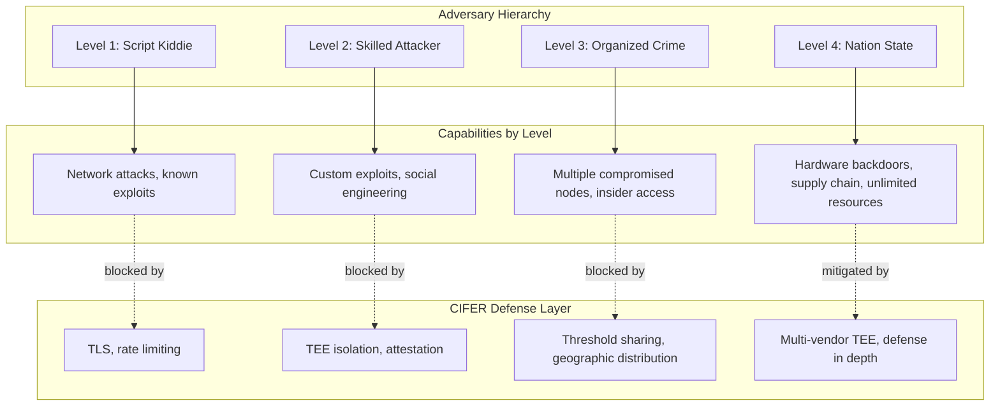
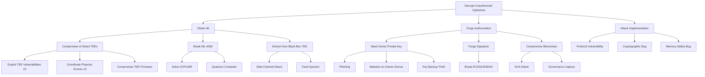

# CIFER Security — Security Analysis

> **Document Version:** 0.2  
> **Last Updated:** 2026-01-08  
> **Classification:** Technical Specification  
> **Target Audience:** Security VCs, Auditors, CISOs, Penetration Testers

---

## Table of Contents

1. [Executive Summary](#1-executive-summary)
2. [Threat Model](#2-threat-model)
3. [Trust Assumptions](#3-trust-assumptions)
4. [Attack Surface Analysis](#4-attack-surface-analysis)
5. [Security Properties](#5-security-properties)
6. [Attack Trees](#6-attack-trees)
7. [Security Reductions](#7-security-reductions)
8. [Comparison with Related Work](#8-comparison-with-related-work)
9. [Known Limitations](#9-known-limitations)
10. [Incident Response](#10-incident-response)
11. [Compliance Mapping](#11-compliance-mapping)
12. [References](#12-references)

---

## 1. Executive Summary

### 1.1 Security Posture Summary

| Aspect | Assessment | Rationale |
|--------|------------|-----------|
| **Cryptographic strength** | Strong | ML-KEM-768 (post-quantum), AES-256-GCM |
| **Key management** | Strong | Distributed custody, TEE protection |
| **Access control** | Strong | Blockchain-enforced, owner signatures |
| **Side-channel resistance** | Moderate | TEE mitigations, constant-time code |
| **Availability** | Moderate | (3,5) threshold allows 2 failures |
| **Quantum resistance** | Strong | Lattice-based KEM |

### 1.2 Key Security Claims

1. **Confidentiality:** Only CIFER owners can decrypt their data
2. **Integrity:** Ciphertext tampering is detectable
3. **Zero-knowledge operation:** Operators cannot access user data
4. **Post-quantum security:** Resistant to quantum computing attacks
5. **Decentralized custody:** No single point of key compromise

### 1.3 Risk Rating Summary

| Threat Category | Likelihood | Impact | Risk Level | Mitigation Status |
|-----------------|------------|--------|------------|-------------------|
| Cryptographic break | Very Low | Critical | Low | ML-KEM NIST standardized |
| Single TEE compromise | Medium | Low | Low | Threshold (t=3) |
| Multiple TEE compromise | Low | Critical | Medium | Geographic diversity |
| Side-channel attack | Medium | High | Medium | Constant-time + mitigations |
| Insider threat | Low | Medium | Low | TEE isolation |
| Supply chain attack | Very Low | Critical | Low | Multi-vendor strategy |

---

## 2. Threat Model

### 2.1 STRIDE Analysis

```
┌─────────────────────────────────────────────────────────────────────┐
│                     STRIDE Threat Modeling                          │
├─────────────────┬───────────────────────────────────────────────────┤
│ Threat          │ CIFER Security Analysis                           │
├─────────────────┼───────────────────────────────────────────────────┤
│ Spoofing        │ Mitigated: Owner signatures, TEE attestation      │
├─────────────────┼───────────────────────────────────────────────────┤
│ Tampering       │ Mitigated: AEAD integrity, blockchain immutability│
├─────────────────┼───────────────────────────────────────────────────┤
│ Repudiation     │ Mitigated: Blockchain audit trail                 │
├─────────────────┼───────────────────────────────────────────────────┤
│ Info Disclosure │ Mitigated: TEE isolation, encryption at rest      │
├─────────────────┼───────────────────────────────────────────────────┤
│ Denial of Svc   │ Partially: Rate limiting, threshold availability  │
├─────────────────┼───────────────────────────────────────────────────┤
│ Elev. of Priv   │ Mitigated: On-chain authorization, TEE isolation  │
└─────────────────┴───────────────────────────────────────────────────┘
```

### 2.2 Adversary Classes

| Adversary | Capabilities | Goals | Relevant Attacks |
|-----------|--------------|-------|------------------|
| **Network adversary** | Eavesdrop, inject, replay | Read plaintext, impersonate | MITM, replay |
| **Malicious cloud provider** | Full host access | Key extraction | Memory inspection, side-channel |
| **Compromised shard operator** | Control 1-2 shard TEEs | Reconstruct keys | Share theft |
| **Nation-state adversary** | Hardware supply chain, multiple TEEs | Targeted surveillance | Supply chain, coordinated TEE attack |
| **Quantum adversary** | Future quantum computer | Decrypt harvested ciphertext | Shor's, Grover's algorithms |
| **Malicious client** | Forge requests | Access other users' data | Authorization bypass |

### 2.3 Adversary Power Levels



### 2.4 Threat Scenarios

#### Scenario 1: Harvest Now, Decrypt Later (HNDL)

```
Threat: Adversary captures encrypted traffic today, waits for
        quantum computer to break encryption.

Attack Vector:
    1. Adversary intercepts ciphertext during transmission
    2. Stores ciphertext indefinitely
    3. Uses future quantum computer for cryptanalysis

CIFER Defense:
    - ML-KEM-768 provides NIST Level 3 post-quantum security
    - 128-bit quantum security margin
    - No known quantum attack on lattice problems

Risk Assessment: LOW
    - ML-KEM designed specifically for HNDL scenario
    - Would require significant quantum computing advances
```

#### Scenario 2: Coordinated TEE Compromise

```
Threat: Adversary compromises ≥ t shard TEEs to reconstruct dk

Attack Vector:
    1. Identify and target t (3) shard TEE hosts
    2. Exploit TEE vulnerabilities (side-channel, bugs)
    3. Extract shares from each compromised TEE
    4. Reconstruct dk

CIFER Defense:
    - Geographic distribution across regions/providers
    - Multi-vendor TEE platforms (SGX, SEV-SNP)
    - Continuous attestation monitoring
    - Proactive key rotation

Risk Assessment: MEDIUM
    - Requires simultaneous compromise of 3+ TEEs
    - Geographic distribution increases attack cost
    - Detection during compromise window possible
```

#### Scenario 3: Malicious Insider

```
Threat: CIFER operator attempts to access user data

Attack Vector:
    1. Operator has host access to TEE machines
    2. Attempts memory inspection, debugging
    3. Tries to extract keys or plaintext

CIFER Defense:
    - TEE isolation: Host cannot read enclave memory
    - Open-source Black Box: No hidden functionality
    - Attestation: Operator cannot substitute code
    - No persistent keys: Secrets exist only during operation

Risk Assessment: LOW
    - TEE provides hardware-enforced isolation
    - Operator access doesn't grant enclave access
    - Requires TEE vulnerability exploitation
```

---

## 3. Trust Assumptions

### 3.1 Trusted Components

| Component | Trust Level | Justification | Verification |
|-----------|-------------|---------------|--------------|
| TEE hardware | Trusted | Intel/AMD security claims | Remote attestation |
| TEE firmware | Trusted | Vendor signed, versioned | TCB verification |
| CIFER enclave code | Trusted | Open-source, audited | MRENCLAVE measurement |
| Cryptographic primitives | Trusted | NIST standardized | Published proofs |
| Blockchain consensus | Trusted (BFT) | Byzantine fault tolerant | On-chain verification |

### 3.2 Untrusted Components

| Component | Trust Level | Why Untrusted | Mitigation |
|-----------|-------------|---------------|------------|
| Host OS | Untrusted | Operator controlled | TEE isolation |
| Hypervisor | Untrusted | Cloud provider controlled | TEE isolation |
| Network | Untrusted | Public internet | TLS + attestation binding |
| CIFER operators | Untrusted | External party | TEE + no key access |
| Cloud providers | Untrusted | Third party | TEE + geographic diversity |

### 3.3 Trust Boundary Diagram

```
┌─────────────────────────────────────────────────────────────────────┐
│                         UNTRUSTED ZONE                               │
│  ┌───────────────────────────────────────────────────────────────┐  │
│  │                      Cloud Provider                            │  │
│  │  ┌─────────────────────────────────────────────────────────┐  │  │
│  │  │                    Host Operating System                 │  │  │
│  │  │  ┌───────────────────────────────────────────────────┐  │  │  │
│  │  │  │                    Hypervisor                      │  │  │  │
│  │  │  │  ╔═══════════════════════════════════════════════╗│  │  │  │
│  │  │  │  ║              TRUSTED ZONE (TEE)               ║│  │  │  │
│  │  │  │  ║  ┌─────────────────────────────────────────┐  ║│  │  │  │
│  │  │  │  ║  │         CIFER Enclave Code              │  ║│  │  │  │
│  │  │  │  ║  │  - Cryptographic operations             │  ║│  │  │  │
│  │  │  │  ║  │  - Key reconstruction                   │  ║│  │  │  │
│  │  │  │  ║  │  - Share storage (sealed)               │  ║│  │  │  │
│  │  │  │  ║  └─────────────────────────────────────────┘  ║│  │  │  │
│  │  │  │  ║                                               ║│  │  │  │
│  │  │  │  ║  ┌─────────────────────────────────────────┐  ║│  │  │  │
│  │  │  │  ║  │         TEE Hardware Root               │  ║│  │  │  │
│  │  │  │  ║  │  - Memory encryption                    │  ║│  │  │  │
│  │  │  │  ║  │  - Attestation keys                     │  ║│  │  │  │
│  │  │  │  ║  └─────────────────────────────────────────┘  ║│  │  │  │
│  │  │  │  ╚═══════════════════════════════════════════════╝│  │  │  │
│  │  │  └───────────────────────────────────────────────────┘  │  │  │
│  │  └─────────────────────────────────────────────────────────┘  │  │
│  └───────────────────────────────────────────────────────────────┘  │
└─────────────────────────────────────────────────────────────────────┘
```

### 3.4 Failure of Trust Assumptions

| Assumption | If Violated | Impact | Detection |
|------------|-------------|--------|-----------|
| TEE isolation | Keys exposed to host | Critical | Attestation anomaly |
| Cryptographic primitives | All ciphertexts decryptable | Critical | Public research |
| t < compromised shards | dk reconstructable by adversary | Critical | Anomaly detection |
| Blockchain integrity | False authorizations | High | Consensus monitoring |

---

## 4. Attack Surface Analysis

### 4.1 External Attack Surface

```
┌─────────────────────────────────────────────────────────────────┐
│                    External Attack Surface                       │
├─────────────────────────────────────────────────────────────────┤
│                                                                  │
│   Internet                                                       │
│       │                                                          │
│       ▼                                                          │
│   ┌───────────────┐                                             │
│   │   WAF/DDoS    │  [A1] DDoS amplification                    │
│   │   Protection  │  [A2] WAF bypass                            │
│   └───────┬───────┘                                             │
│           │                                                      │
│           ▼                                                      │
│   ┌───────────────┐                                             │
│   │   Load        │  [A3] SSL termination attacks               │
│   │   Balancer    │  [A4] Request smuggling                     │
│   └───────┬───────┘                                             │
│           │                                                      │
│           ▼                                                      │
│   ┌───────────────┐                                             │
│   │   API Gateway │  [A5] Authentication bypass                 │
│   │               │  [A6] Rate limit bypass                     │
│   └───────┬───────┘  [A7] Input validation                      │
│           │                                                      │
│           ▼                                                      │
│   ┌───────────────┐                                             │
│   │   Black Box   │  [A8] TEE exploitation                      │
│   │   (TEE)       │  [A9] Protocol attacks                      │
│   └───────────────┘  [A10] Side-channel                         │
│                                                                  │
└─────────────────────────────────────────────────────────────────┘
```

### 4.2 Attack Surface Mitigations

| ID | Attack Vector | Mitigation | Residual Risk |
|----|---------------|------------|---------------|
| A1 | DDoS | Anycast, scrubbing, rate limiting | Service degradation |
| A2 | WAF bypass | Layered WAF, regular updates | Zero-day exploit |
| A3 | SSL attacks | TLS 1.3, cert pinning | Implementation bugs |
| A4 | Request smuggling | Strict HTTP parsing | Parser discrepancies |
| A5 | Auth bypass | Cryptographic signatures | Key compromise |
| A6 | Rate limit bypass | Distributed rate limiting | Sophisticated evasion |
| A7 | Input validation | Schema validation, fuzzing | Logic errors |
| A8 | TEE exploitation | Patching, attestation | Zero-day TEE vulns |
| A9 | Protocol attacks | Formal verification | Spec errors |
| A10 | Side-channel | Constant-time, mitigations | Unknown channels |

### 4.3 Internal Attack Surface

```
Internal Attack Surface (Operator Access):

+------------------+---------------------------+--------------------+
| Access Type      | Potential Attack          | Mitigation         |
+------------------+---------------------------+--------------------+
| Host SSH         | Memory dump attempt       | TEE encryption     |
| Container access | Container escape          | Minimal container  |
| Network access   | Traffic interception      | TLS + attestation  |
| Log access       | Sensitive data in logs    | No plaintext logs  |
| Backup access    | Sealed data theft         | Seal to enclave ID |
| Config access    | Parameter manipulation    | Config attestation |
+------------------+---------------------------+--------------------+
```

### 4.4 Supply Chain Attack Surface

```
Supply Chain Risk Assessment:

Hardware:
    - CPU: Intel/AMD - Moderate risk (nation-state level)
    - Server: OEM - Low risk (attestation catches tampering)
    - Network equipment: Low-Moderate risk (TLS mitigation)

Software:
    - OS: Linux distributions - Moderate risk (reproducible builds)
    - TEE SDK: Intel/AMD SDK - Low risk (verified, signed)
    - Dependencies: Cryptographic libraries - Moderate risk
      Mitigation: Dependency pinning, audit, minimal deps

Cloud Services:
    - Azure/GCP/AWS: Low risk for confidentiality (TEE isolation)
    - DNS providers: Moderate risk (DNSSEC mitigation)
    - Certificate authorities: Moderate risk (CT logs)
```

---

## 5. Security Properties

### 5.1 Formal Security Properties

#### Property 1: Ciphertext Indistinguishability (IND-CCA2)

```
Definition: For any PPT adversary A:
    Adv^{IND-CCA2}_CIFER(A) ≤ negl(λ)

Experiment:
    1. Challenger generates CIFER (cifer_id, ek, dk)
    2. A has access to Decrypt oracle (except for challenge)
    3. A submits (m_0, m_1)
    4. Challenger encrypts m_b for random b ∈ {0,1}
    5. A guesses b' with access to Decrypt oracle
    6. A wins if b' = b

CIFER achieves this via:
    - ML-KEM-768 IND-CCA2 security
    - AES-256-GCM IND-CPA + INT-CTXT
```

#### Property 2: Key Indistinguishability

```
Definition: An adversary controlling < t shard TEEs cannot
            distinguish dk from random.

Formal: For A controlling shards S where |S| < t:
    |Pr[A(shares_S) = 1 | dk real] - Pr[A(shares_S) = 1 | dk random]| = 0

This is information-theoretic (not computational):
    - Shamir's scheme achieves perfect secrecy
    - < t shares contain zero information about secret
```

#### Property 3: Authorization Unforgeability

```
Definition: No adversary can forge a valid decrypt authorization
            without the owner's private key.

Formal: For A without access to owner_sk:
    Pr[A produces valid (cifer_id, request_id, timestamp, sig)] ≤ negl(λ)

Where valid means:
    Verify(owner_pk, sig, H(cifer_id || request_id || timestamp)) = true

CIFER achieves this via:
    - ECDSA or EdDSA signature scheme (EUF-CMA secure)
    - Replay protection via request_id uniqueness
```

#### Property 4: Forward Secrecy

```
Definition: Compromise of current key material does not compromise
            past encrypted sessions.

Analysis:
    - Each Encrypt operation uses fresh KEM randomness
    - (ct_kem, ss) is unique per encryption
    - Past ciphertexts use different ss values
    - dk compromise doesn't reveal past ss values
      (without corresponding ct_kem)

Partial forward secrecy:
    - Past ciphertexts WITH their ct_kem can be decrypted
    - This is inherent to public-key encryption
    - Full forward secrecy would require key rotation
```

### 5.2 Security Invariants

```
Invariant 1: Key Isolation
    ∀ time t, ∀ untrusted component U:
        dk ∉ accessible_memory(U)
    
    Proof: 
        - dk only exists inside TEE during reconstruction
        - TEE memory inaccessible to host/hypervisor
        - dk erased immediately after use

Invariant 2: Share Distribution
    ∀ shard_tee S_i:
        |shares_held(S_i)| = 1
        information(shares_held(S_i)) < 1/t * information(dk)
    
    Proof:
        - Each TEE receives exactly one share
        - Shamir (t,n) reveals nothing from < t shares

Invariant 3: Authorization Chain
    ∀ successful decrypt D:
        ∃ valid signature sig by owner_sk on D.request
    
    Proof:
        - Blockchain verifies signature before authorization
        - Shard TEEs verify blockchain authorization
        - No path bypasses signature verification

Invariant 4: Audit Completeness
    ∀ state-changing operation O:
        ∃ blockchain record R corresponding to O
    
    Proof:
        - Create, Rotate, Revoke require blockchain transactions
        - Decrypt requires blockchain authorization
        - All operations leave on-chain trace
```

---

## 6. Attack Trees

### 6.1 Goal: Decrypt Unauthorized Ciphertext



### 6.2 Attack Path Cost Analysis

| Attack Path | Technical Difficulty | Cost Estimate | Time | Detection Risk |
|-------------|---------------------|---------------|------|----------------|
| Compromise 3 TEEs (different vendors) | Very High | $10M+ | Months | High |
| Break ML-KEM-768 | Infeasible | N/A | N/A | N/A |
| Side-channel on Black Box | High | $100K-1M | Weeks | Medium |
| Steal owner private key | Medium | $10K-100K | Days | Low |
| Break ECDSA | Infeasible | N/A | N/A | N/A |
| 51% blockchain attack | High | $1M+ (depends on chain) | Hours | Very High |
| Implementation bug | Variable | $0-100K | Variable | Variable |

### 6.3 Minimum Attack Cost

```
Minimum Viable Attack Analysis:

To decrypt without authorization:
    Option A: Compromise 3 TEEs
        - Requires 3 independent TEE zero-days, OR
        - Physical access to 3 geographically distributed sites
        - Estimated cost: >$10M
        - Detection probability: High
    
    Option B: Steal owner key + forge request
        - Social engineering or endpoint compromise
        - Estimated cost: $10K-100K
        - Detection probability: Low
        - Mitigation: Owner security practices, MFA
    
    Option C: Find implementation bug
        - Requires discovering exploitable vulnerability
        - Estimated cost: Variable (bug bounty economics)
        - Detection probability: Variable
        - Mitigation: Audits, formal verification, bug bounty

Conclusion: Option B (owner key theft) is most cost-effective
            but targets owner, not CIFER infrastructure
```

---

## 7. Security Reductions

### 7.1 Main Security Theorem

**Theorem (CIFER Security):** The CIFER encryption scheme is IND-CCA2 secure in the random oracle model under the following assumptions:

1. ML-KEM-768 is IND-CCA2 secure (Module-LWE hardness)
2. AES-256-GCM is IND-CPA and INT-CTXT secure
3. HKDF-SHA-384 is a secure PRF
4. (3,5)-Shamir scheme provides perfect secrecy
5. TEE isolation holds against polynomial-time adversaries

### 7.2 Proof Sketch

```
Reduction Strategy: Hybrid argument

Game 0: Real CIFER IND-CCA2 game
    - Adversary interacts with real system
    - Receives real challenge ciphertext

Game 1: Replace ML-KEM shared secret with random
    - Change: ss ← random(32) instead of Decaps
    - Distinguisher breaks ML-KEM IND-CCA2
    - |Pr[G1] - Pr[G0]| ≤ Adv^{IND-CCA2}_{ML-KEM}

Game 2: Replace HKDF output with random
    - Change: FEK ← random(32) instead of HKDF(ss)
    - Distinguisher breaks HKDF PRF
    - |Pr[G2] - Pr[G1]| ≤ Adv^{PRF}_{HKDF}

Game 3: Replace AEAD ciphertext
    - Change: ct_data encrypts zeros
    - Distinguisher breaks AES-GCM IND-CPA
    - |Pr[G3] - Pr[G2]| ≤ Adv^{IND-CPA}_{AES-GCM}

Game 4: Challenge ciphertext independent of message
    - Adversary advantage is 0
    - Pr[G4] = 1/2

Total advantage bound:
    Adv^{IND-CCA2}_{CIFER} ≤ Adv^{IND-CCA2}_{ML-KEM} 
                           + Adv^{PRF}_{HKDF}
                           + Adv^{IND-CPA}_{AES-GCM}
                           + Adv^{INT-CTXT}_{AES-GCM}
```

### 7.3 Concrete Security Estimates

| Primitive | Security Parameter | Advantage Bound |
|-----------|-------------------|-----------------|
| ML-KEM-768 | 192-bit classical, 128-bit quantum | 2^-128 |
| HKDF-SHA-384 | 192-bit | 2^-192 |
| AES-256-GCM | 256-bit key, 128-bit tag | 2^-128 |
| **CIFER Total** | **128-bit quantum** | **2^-128** |

### 7.4 Threshold Security Proof

**Theorem (Share Security):** An adversary controlling fewer than t = 3 shard TEEs learns zero information about dk.

**Proof:**
```
Shamir's Secret Sharing over GF(2^256):

Given: Polynomial f(x) = a_0 + a_1*x + a_2*x^2
       where a_0 = dk (secret), a_1, a_2 ← random

Share i: s_i = f(i) for i ∈ {1, 2, 3, 4, 5}

Information-theoretic argument:
    - For any 2 shares (s_i, s_j), there exists a unique degree-2 
      polynomial f' passing through these points for ANY choice of a_0
    - Therefore, observing 2 shares is consistent with every possible dk
    - No computational assumption required
    
Formally: For |S| < t shares:
    H(dk | shares_S) = H(dk)
    
    Where H is Shannon entropy.
    
Conclusion: Perfect secrecy - shares reveal nothing about dk.
```

---

## 8. Comparison with Related Work

### 8.1 Key Management Systems Comparison

| System | Key Storage | Post-Quantum | Threshold | TEE | Zero-Knowledge |
|--------|-------------|--------------|-----------|-----|----------------|
| **CIFER** | Distributed TEE | Yes (ML-KEM) | Yes (3,5) | Yes | Yes |
| AWS KMS | HSM | No | No | No | No (AWS access) |
| HashiCorp Vault | Memory/HSM | No | Shamir | Optional | No |
| Google Cloud KMS | HSM | No | No | No | No (Google access) |
| Azure Key Vault | HSM | No | No | SGX option | Partial |
| Keybase | Device keys | No | No | No | Yes |

### 8.2 Academic System Comparison

| System | Paper | Approach | Difference from CIFER |
|--------|-------|----------|----------------------|
| CALYPSO | S&P 2019 | Threshold + blockchain | No TEE, no post-quantum |
| CHURP | CCS 2019 | Proactive secret sharing | More complex resharing |
| F3B | NDSS 2022 | TEE-based | Single TEE, no distribution |
| BITE | USENIX 2019 | Bitcoin + TEE | Bitcoin-specific |

### 8.3 Security Property Comparison

```
┌──────────────────┬────────┬────────┬────────┬────────┬────────┐
│ Property         │ CIFER  │ AWS KMS│ Vault  │ CALYPSO│ CHURP  │
├──────────────────┼────────┼────────┼────────┼────────┼────────┤
│ Post-quantum     │   ✓    │   ✗    │   ✗    │   ✗    │   ✗    │
│ Distributed key  │   ✓    │   ✗    │   ✓    │   ✓    │   ✓    │
│ Hardware isolation│   ✓    │   ✓    │   ◐    │   ✗    │   ✗    │
│ Zero-knowledge   │   ✓    │   ✗    │   ✗    │   ✓    │   ✓    │
│ Public verifiable│   ✓    │   ✗    │   ✗    │   ✓    │   ✓    │
│ Open source      │   ✓    │   ✗    │   ✓    │   ✓    │   ✓    │
│ Production ready │   ◐    │   ✓    │   ✓    │   ✗    │   ✗    │
└──────────────────┴────────┴────────┴────────┴────────┴────────┘

Legend: ✓ = Yes, ✗ = No, ◐ = Partial
```

---

## 9. Known Limitations

### 9.1 Architectural Limitations

| Limitation | Description | Mitigation | Residual Risk |
|------------|-------------|------------|---------------|
| **TEE trust** | Relies on TEE security claims | Multi-vendor diversity | TEE zero-day |
| **Availability threshold** | 2 shard failures = no decrypt | Standby instances | Simultaneous failures |
| **Latency** | Decrypt requires multi-round | Caching, optimization | ~100-500ms latency |
| **Key rotation window** | Old key valid during rotation | 30-day limit | Window exploitation |

### 9.2 Cryptographic Limitations

| Limitation | Description | Future Mitigation |
|------------|-------------|-------------------|
| **No forward secrecy** | Past ciphertexts decryptable with dk | Frequent rotation |
| **Deterministic** | Same input → same ciphertext | Randomized encryption |
| **Large ciphertext** | ML-KEM adds 1088 bytes overhead | Accept trade-off |

### 9.3 Operational Limitations

```
Limitation: Client Endpoint Security
    - CIFER cannot protect data on compromised client devices
    - Plaintext exposed before encryption / after decryption
    - Mitigation: Out of scope, recommend endpoint security

Limitation: Metadata Leakage
    - cifer_id visible in ciphertext
    - Encryption/decryption patterns observable
    - Mitigation: Traffic analysis resistance is non-goal

Limitation: Regulatory Key Escrow
    - Some jurisdictions may require key escrow
    - Architecture doesn't support backdoors by design
    - Mitigation: Legal/compliance separate concern
```

### 9.4 Residual Risks Summary

```
Risk Register:

ID   Risk                        Likelihood  Impact    Status
R1   TEE zero-day vulnerability  Medium      High      Accept (mitigated)
R2   Coordinated TEE compromise  Low         Critical  Accept (mitigated)
R3   Side-channel attacks        Medium      Medium    Accept (mitigated)
R4   Client endpoint compromise  High        Variable  Transfer (to user)
R5   Regulatory intervention     Low         High      Accept (by design)
R6   Cryptographic breakthrough  Very Low    Critical  Accept (standards)
R7   Operational errors          Medium      Medium    Mitigate (procedures)
```

---

## 10. Incident Response

### 10.1 Security Incident Classification

| Severity | Description | Response Time | Notification |
|----------|-------------|---------------|--------------|
| **P0 - Critical** | Active key compromise, data breach | Immediate | All users, regulators |
| **P1 - High** | Vulnerability in production, single TEE compromise | 4 hours | Affected users |
| **P2 - Medium** | Vulnerability in non-prod, DoS | 24 hours | Internal |
| **P3 - Low** | Minor issues, informational | 72 hours | Internal |

### 10.2 Incident Response Procedures

```
P0 Incident Response (Key Compromise):

1. DETECT (T+0)
   - Automated monitoring alerts
   - Security team notification
   - Incident commander assigned

2. CONTAIN (T+15min)
   - Isolate compromised components
   - Disable affected shards
   - Block suspicious requests

3. ASSESS (T+1h)
   - Determine scope of compromise
   - Identify affected CIFERs
   - Evaluate data exposure

4. MITIGATE (T+2h)
   - Force key rotation for affected CIFERs
   - Revoke compromised credentials
   - Deploy patches if applicable

5. NOTIFY (T+4h)
   - User notification
   - Regulatory notification (if required)
   - Public disclosure (if appropriate)

6. RECOVER (T+24h)
   - Restore normal operations
   - Verify integrity
   - Monitor for recurrence

7. POST-INCIDENT (T+1w)
   - Root cause analysis
   - Update procedures
   - Implement improvements
```

### 10.3 Key Compromise Recovery

```
Key Compromise Recovery Procedure:

Scenario: Adversary obtained dk for cifer_id

Immediate Actions:
    1. Verify compromise (not false positive)
    2. Assess: Which ciphertexts are at risk?
    3. Force key rotation: rotate_key(cifer_id, emergency=true)
    
User Actions Required:
    1. Notify user of compromise
    2. User must re-encrypt sensitive data with new key
    3. Consider data compromised if encrypted before rotation
    
Preventive Actions:
    1. Forensic analysis of compromise vector
    2. Patch vulnerabilities
    3. Review and improve monitoring
    4. Consider increasing threshold (t → t+1)
```

### 10.4 Business Continuity

```
Availability Targets:

Service Level:
    - Encrypt: 99.9% availability
    - Decrypt: 99.9% availability (with ≥t shards)
    - Create CIFER: 99.5% availability

Recovery Objectives:
    - RTO (Recovery Time Objective): 4 hours
    - RPO (Recovery Point Objective): 0 (no data loss)

Degraded Mode Operations:
    - If 1 shard down: Full operation
    - If 2 shards down: Full operation (minimum)
    - If 3+ shards down: Decrypt unavailable
        → Emergency: Activate standby shards
        → User notification
```

---

## 11. Compliance Mapping

### 11.1 SOC 2 Type II Mapping

| Trust Service Criteria | CIFER Control | Evidence |
|----------------------|---------------|----------|
| CC6.1 Logical access | TEE attestation, owner signatures | Attestation logs |
| CC6.2 Access removal | Key revocation on chain | Blockchain records |
| CC6.3 Access security | TLS 1.3, attestation binding | TLS certificates |
| CC6.6 Encryption | AES-256-GCM, ML-KEM-768 | Crypto configuration |
| CC6.7 Transmission security | TLS 1.3 | Network captures |
| CC7.1 Detection | Monitoring, anomaly detection | Alert history |
| CC7.2 Monitoring | Continuous attestation | Attestation logs |

### 11.2 GDPR Article 32 Mapping

| Requirement | CIFER Implementation |
|-------------|---------------------|
| Pseudonymization | cifer_id decoupled from user identity |
| Encryption | AES-256-GCM, ML-KEM-768 |
| Confidentiality | TEE isolation, threshold sharing |
| Integrity | AEAD tags, blockchain immutability |
| Availability | (3,5) threshold, geographic distribution |
| Resilience | Multi-region, multi-vendor |
| Testing | Security audits, penetration testing |

### 11.3 HIPAA Security Rule Mapping

| Standard | Specification | CIFER Control |
|----------|--------------|---------------|
| 164.312(a)(1) | Access control | Owner-only decrypt |
| 164.312(a)(2)(iv) | Encryption | AES-256-GCM |
| 164.312(b) | Audit controls | Blockchain audit trail |
| 164.312(c)(1) | Integrity | AEAD, blockchain |
| 164.312(d) | Authentication | Signature verification |
| 164.312(e)(1) | Transmission security | TLS 1.3 |

### 11.4 PCI DSS v4.0 Mapping

| Requirement | CIFER Control |
|-------------|---------------|
| 3.5.1 Key storage | Sealed in TEE, distributed |
| 3.6.1 Key generation | Inside TEE, ML-KEM-768 |
| 3.7.1 Key rotation | Protocol supported |
| 4.2.1 Strong cryptography | AES-256, ML-KEM-768 |
| 8.3.1 Authentication | Owner signatures |

---

## 12. References

### Security Standards

1. **NIST SP 800-53** — Security and Privacy Controls, Rev. 5
2. **NIST SP 800-57** — Key Management, Part 1, Rev. 5
3. **ISO 27001:2022** — Information Security Management
4. **CIS Controls v8** — Center for Internet Security

### Academic Security Research

5. **Costan, V. and Devadas, S.** — "Intel SGX Explained", IACR ePrint 2016
6. **Van Bulck, J. et al.** — "A Tale of Two Worlds: Assessing the Vulnerability of Enclave Shielding Runtimes", CCS 2019
7. **Schwarz, M. et al.** — "Plundervolt: Software-based Fault Injection Attacks against Intel SGX", IEEE S&P 2020
8. **Li, M. et al.** — "SEVerity: Code Injection Attacks against Encrypted Virtual Machines", USENIX Security 2021

### Cryptographic Security

9. **Bos, J. et al.** — "CRYSTALS-Kyber: Security Analysis", IEEE Euro S&P 2018
10. **Dworkin, M.** — "Recommendation for Block Cipher Modes: GCM and GMAC", NIST SP 800-38D
11. **Krawczyk, H.** — "Cryptographic Extraction and Key Derivation: The HKDF Scheme", CRYPTO 2010

### Threat Modeling

12. **Shostack, A.** — "Threat Modeling: Designing for Security", Wiley 2014
13. **MITRE ATT&CK** — Enterprise Tactics and Techniques

---

## Appendix A: Security Audit Checklist

```
Pre-deployment Security Checklist:

Cryptographic Implementation:
[ ] ML-KEM-768 passes NIST KAT vectors
[ ] AES-256-GCM passes NIST CAVP validation
[ ] HKDF-SHA-384 passes RFC 5869 test vectors
[ ] Constant-time operations verified (timing analysis)
[ ] No compiler optimization of secure erasure
[ ] Entropy source passes NIST SP 800-90B tests

TEE Security:
[ ] Enclave code is reproducibly built
[ ] MRENCLAVE matches expected value
[ ] No DEBUG flag in production
[ ] TCB components at current versions
[ ] Side-channel mitigations enabled
[ ] Attestation verification implemented

Protocol Security:
[ ] Replay protection functional
[ ] Rate limiting enforced
[ ] Input validation on all endpoints
[ ] Error messages don't leak sensitive info
[ ] Timeout handling correct
[ ] State machine transitions verified

Operational Security:
[ ] Secrets not in logs
[ ] Monitoring and alerting configured
[ ] Incident response procedures documented
[ ] Backup and recovery tested
[ ] Access controls enforced
[ ] Penetration test completed
```

---

## Appendix B: Vulnerability Disclosure Policy

```
CIFER Security Vulnerability Disclosure:

Scope:
    - CIFER enclave code
    - Protocol implementations
    - API endpoints
    - SDK libraries

Out of Scope:
    - Third-party TEE vulnerabilities (report to Intel/AMD)
    - Social engineering
    - Physical attacks
    - DoS without security impact

Reporting:
    - Email: security@cifer.example (PGP key available)
    - Bug bounty: Rewards based on severity
    - Response: Acknowledgment within 24 hours

Disclosure Timeline:
    - T+0: Report received
    - T+24h: Acknowledgment
    - T+7d: Initial assessment
    - T+90d: Coordinated disclosure (or earlier if patched)

Safe Harbor:
    - Good faith security research protected
    - No legal action for compliant disclosure
```


