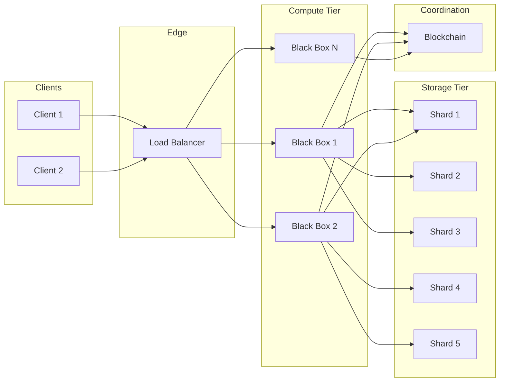
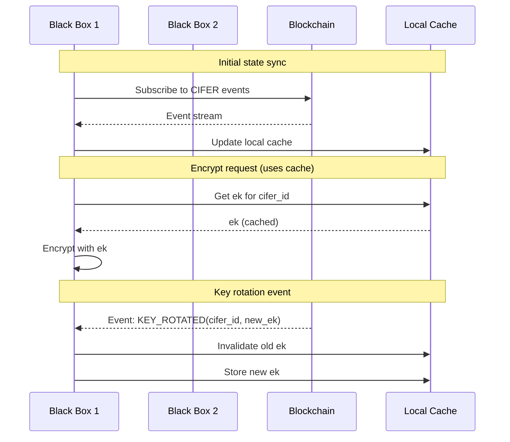
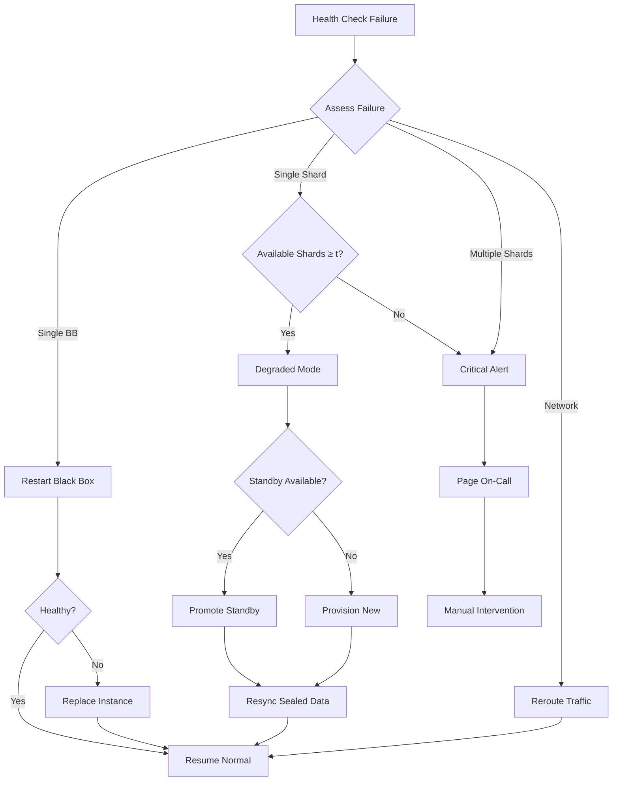
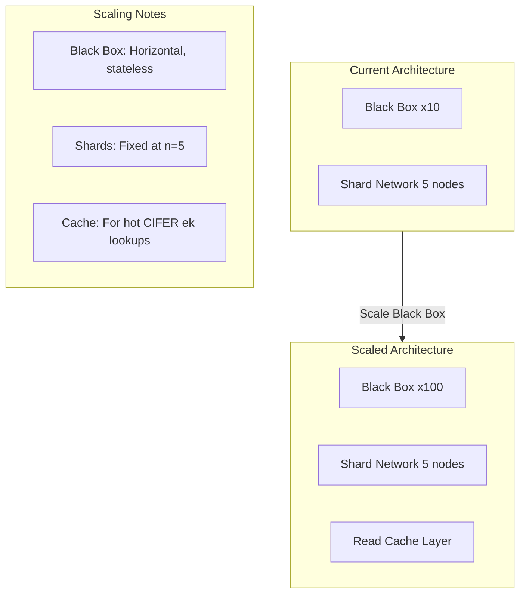

# CIFER Security — Distributed Systems Architecture

> **Document Version:** 0.2  
> **Last Updated:** 2026-01-08  
> **Classification:** Technical Specification  
> **Target Audience:** Infrastructure Engineers, SREs, Technical Due Diligence

---

## Table of Contents

1. [Introduction](#1-introduction)
2. [System Architecture Overview](#2-system-architecture-overview)
3. [CAP Theorem Analysis](#3-cap-theorem-analysis)
4. [Consistency Model](#4-consistency-model)
5. [Network Topology](#5-network-topology)
6. [Failure Detection and Recovery](#6-failure-detection-and-recovery)
7. [Geographic Distribution](#7-geographic-distribution)
8. [Performance Analysis](#8-performance-analysis)
9. [Scalability](#9-scalability)
10. [Operational Procedures](#10-operational-procedures)
11. [Monitoring and Observability](#11-monitoring-and-observability)
12. [References](#12-references)

---

## 1. Introduction

### 1.1 Purpose

This document specifies the distributed systems architecture for CIFER Security's zero-key encryption platform. It covers the design decisions for achieving high availability, fault tolerance, and performance across a geographically distributed TEE network.

### 1.2 Design Objectives

| Objective | Target | Rationale |
|-----------|--------|-----------|
| **Availability** | 99.9% uptime | Enterprise-grade service |
| **Durability** | No key loss | Cryptographic material is irreplaceable |
| **Latency** | P99 < 500ms | Acceptable UX for encryption/decryption |
| **Throughput** | 10K ops/sec | Support enterprise workloads |
| **Fault tolerance** | 2 node failures | (3,5) threshold scheme |

### 1.3 System Scale

```
Production Deployment Scale:

Shard TEE Network:
    - 5 primary shard TEEs (n=5)
    - 5 standby shard TEEs
    - 3 geographic regions minimum
    - 2+ cloud providers
    
Black Box Fleet:
    - 10-100 instances (auto-scaling)
    - Load balanced across regions
    - Stateless operation
    
Blockchain:
    - Permissioned chain (BFT consensus)
    - 7+ validator nodes
    - 3+ geographic regions
    
Expected Load:
    - 1M+ CIFERs
    - 10K concurrent connections
    - 100K daily encrypt/decrypt operations
```

---

## 2. System Architecture Overview

### 2.1 High-Level Architecture

```
┌─────────────────────────────────────────────────────────────────────────┐
│                           CIFER Infrastructure                           │
├─────────────────────────────────────────────────────────────────────────┤
│                                                                          │
│    ┌──────────────┐     ┌──────────────┐     ┌──────────────┐          │
│    │   Client     │     │   Client     │     │   Client     │          │
│    └──────┬───────┘     └──────┬───────┘     └──────┬───────┘          │
│           │                    │                    │                    │
│           └────────────────────┼────────────────────┘                    │
│                                │                                         │
│                         ┌──────▼──────┐                                 │
│                         │   Global    │                                 │
│                         │   Load      │  Anycast / GeoDNS              │
│                         │   Balancer  │                                 │
│                         └──────┬──────┘                                 │
│                                │                                         │
│         ┌──────────────────────┼──────────────────────┐                 │
│         │                      │                      │                  │
│         ▼                      ▼                      ▼                  │
│  ┌─────────────┐       ┌─────────────┐       ┌─────────────┐           │
│  │  Region US  │       │  Region EU  │       │ Region APAC │           │
│  │             │       │             │       │             │           │
│  │ ┌─────────┐ │       │ ┌─────────┐ │       │ ┌─────────┐ │           │
│  │ │Black Box│ │       │ │Black Box│ │       │ │Black Box│ │           │
│  │ │  Fleet  │ │       │ │  Fleet  │ │       │ │  Fleet  │ │           │
│  │ └────┬────┘ │       │ └────┬────┘ │       │ └────┬────┘ │           │
│  │      │      │       │      │      │       │      │      │           │
│  │ ┌────┴────┐ │       │ ┌────┴────┐ │       │ ┌────┴────┐ │           │
│  │ │Shard TEE│ │       │ │Shard TEE│ │       │ │Shard TEE│ │           │
│  │ │ #1, #4  │ │       │ │ #2, #5  │ │       │ │   #3    │ │           │
│  │ └─────────┘ │       │ └─────────┘ │       │ └─────────┘ │           │
│  └─────────────┘       └─────────────┘       └─────────────┘           │
│         │                      │                      │                  │
│         └──────────────────────┼──────────────────────┘                  │
│                                │                                         │
│                         ┌──────▼──────┐                                 │
│                         │ Blockchain  │                                 │
│                         │  Network    │  Distributed across regions     │
│                         └─────────────┘                                 │
│                                                                          │
└─────────────────────────────────────────────────────────────────────────┘
```

### 2.2 Component Responsibilities

| Component | Responsibility | Statefulness | Scaling |
|-----------|---------------|--------------|---------|
| Global LB | Traffic routing, DDoS protection | Stateless | Anycast |
| Black Box | Crypto operations | Stateless | Horizontal |
| Shard TEE | Share storage | Stateful | Fixed (n=5) |
| Blockchain | State, permissions | Stateful | BFT replicas |

### 2.3 Data Flow Patterns



---

## 3. CAP Theorem Analysis

### 3.1 CAP Trade-offs

The CAP theorem states that a distributed system can provide at most two of:
- **C**onsistency: All nodes see the same data at the same time
- **A**vailability: Every request receives a response
- **P**artition tolerance: System operates despite network partitions

### 3.2 CIFER CAP Position

```
┌─────────────────────────────────────────────────────────────────┐
│                     CAP Triangle                                 │
│                                                                  │
│                          Consistency                             │
│                              /\                                  │
│                             /  \                                 │
│                            /    \                                │
│                           /  CP  \                               │
│                          /        \                              │
│                         /    ●     \    ← Blockchain             │
│                        /   CIFER    \                            │
│                       /              \                           │
│                      /________________\                          │
│           Availability              Partition Tolerance          │
│                 ● ← Black Box           ● ← Shard TEEs          │
│                                                                  │
└─────────────────────────────────────────────────────────────────┘

CIFER chooses: CP (Consistency + Partition Tolerance)
    - Sacrifice: Temporary unavailability during partitions
    - Reason: Cryptographic operations require consistency
```

### 3.3 Component-Level CAP Analysis

| Component | CAP Choice | Rationale |
|-----------|------------|-----------|
| **Blockchain** | CP | Must agree on authorization state |
| **Shard TEEs** | CP | Share consistency is critical |
| **Black Box** | AP | Stateless, any instance can serve |

### 3.4 Partition Scenarios

```
Scenario 1: Region Isolation
    Condition: Region X cannot reach other regions
    Impact: 
        - Clients in X can still encrypt (Black Box has cached ek)
        - Clients in X cannot decrypt (need shares from other regions)
        - t=3 requires cross-region communication
    Mitigation: Multi-region shard placement

Scenario 2: Shard TEE Partition
    Condition: Shard TEE #3 unreachable
    Impact:
        - 4 shards available (4 ≥ t=3)
        - Full operation continues
    Mitigation: None needed, threshold handles this

Scenario 3: Blockchain Partition
    Condition: Blockchain network partitioned
    Impact:
        - New CIFERs cannot be created
        - Existing decrypts may stall (authorization check)
        - Encrypts continue (only need ek lookup)
    Mitigation: BFT consensus tolerates minority partition

Scenario 4: Complete Client Isolation
    Condition: Client cannot reach CIFER infrastructure
    Impact:
        - No operations possible
    Mitigation: Client-side retry, offline mode (future)
```

---

## 4. Consistency Model

### 4.1 Consistency Guarantees

| Operation | Consistency Level | Description |
|-----------|------------------|-------------|
| CreateCIFER | Strong | Blockchain confirms before completion |
| Encrypt | Eventual | ek lookup can use slightly stale data |
| Decrypt | Strong | Authorization must be current |
| Rotate | Strong | Sequential key version updates |

### 4.2 Ordering Guarantees

```
CIFER Operation Ordering:

Per-CIFER Ordering:
    - CreateCIFER happens-before any Encrypt/Decrypt
    - Rotate[v] happens-before Rotate[v+1]
    - Decrypt uses latest authorized key version

Global Ordering:
    - Blockchain provides total order for state changes
    - Shard operations are partially ordered
    
Lamport Timestamps:
    - Each operation includes logical timestamp
    - Used for conflict resolution
```

### 4.3 State Synchronization



### 4.4 Conflict Resolution

```
Conflict Resolution Strategy:

Rule 1: Blockchain is source of truth
    - All state conflicts resolved by blockchain state
    - "Last write wins" with blockchain timestamps

Rule 2: Share conflicts
    - If shard TEE has multiple versions of share:
        - Use highest key_version
        - Old versions kept until rotation deadline

Rule 3: Authorization conflicts
    - If authorization state unclear:
        - Deny operation (fail closed)
        - Request fresh authorization from blockchain

Rule 4: Network splits
    - Minority partition: Read-only mode
    - Majority partition: Full operation
```

---

## 5. Network Topology

### 5.1 Physical Topology

```
┌─────────────────────────────────────────────────────────────────────────┐
│                      Physical Network Topology                           │
├─────────────────────────────────────────────────────────────────────────┤
│                                                                          │
│  North America                  Europe                     Asia-Pacific  │
│  ┌─────────────┐               ┌─────────────┐            ┌───────────┐ │
│  │  US-EAST-1  │               │  EU-WEST-1  │            │ AP-SOUTH-1│ │
│  │  (AWS)      │               │  (Azure)    │            │  (GCP)    │ │
│  │             │               │             │            │           │ │
│  │ ┌─────────┐ │               │ ┌─────────┐ │            │┌─────────┐│ │
│  │ │Shard #1 │ │               │ │Shard #2 │ │            ││Shard #3 ││ │
│  │ └─────────┘ │               │ └─────────┘ │            │└─────────┘│ │
│  │ ┌─────────┐ │               │ ┌─────────┐ │            │           │ │
│  │ │Shard #4 │ │               │ │Shard #5 │ │            │           │ │
│  │ └─────────┘ │               │ └─────────┘ │            │           │ │
│  │             │               │             │            │           │ │
│  │ ┌─────────┐ │               │ ┌─────────┐ │            │┌─────────┐│ │
│  │ │Black Box│ │               │ │Black Box│ │            ││Black Box││ │
│  │ │  Fleet  │ │               │ │  Fleet  │ │            ││ Fleet   ││ │
│  │ └─────────┘ │               │ └─────────┘ │            │└─────────┘│ │
│  └─────┬───────┘               └─────┬───────┘            └────┬──────┘ │
│        │                             │                          │        │
│        │    ┌────────────────────────┼──────────────────────────┤        │
│        │    │                        │                          │        │
│        └────┼────────────────────────┼──────────────────────────┼────────│
│             │     Private Backbone   │     (VPN Mesh)           │        │
│             │        100 Gbps        │                          │        │
│        ┌────┴────────────────────────┴──────────────────────────┴────┐   │
│        │                      Internet / CDN                          │   │
│        └─────────────────────────────────────────────────────────────┘   │
│                                                                          │
└─────────────────────────────────────────────────────────────────────────┘
```

### 5.2 Network Connectivity Matrix

| From → To | Shard 1 | Shard 2 | Shard 3 | Shard 4 | Shard 5 | Black Box |
|-----------|---------|---------|---------|---------|---------|-----------|
| Shard 1 | - | VPN | VPN | Local | VPN | Local |
| Shard 2 | VPN | - | VPN | VPN | Local | Local |
| Shard 3 | VPN | VPN | - | VPN | VPN | Local |
| Shard 4 | Local | VPN | VPN | - | VPN | Local |
| Shard 5 | VPN | Local | VPN | VPN | - | Local |
| Black Box | Local | Local | Local | Local | Local | - |

### 5.3 Latency Matrix (P50, milliseconds)

| From → To | US-East | EU-West | AP-South |
|-----------|---------|---------|----------|
| US-East | 5 | 85 | 180 |
| EU-West | 85 | 5 | 140 |
| AP-South | 180 | 140 | 5 |

### 5.4 Network Security

```
Network Security Architecture:

Layer 1: DDoS Protection
    - Anycast distribution
    - Cloud provider scrubbing
    - Rate limiting at edge

Layer 2: Edge Encryption
    - TLS 1.3 termination at LB
    - Certificate pinning for mobile clients
    - HSTS enforcement

Layer 3: Internal Encryption
    - mTLS between all components
    - Certificate rotation every 24 hours
    - Private CA for internal certs

Layer 4: TEE Channel Security
    - Attestation-bound TLS
    - Additional encryption layer for shares
    - Perfect forward secrecy
```

---

## 6. Failure Detection and Recovery

### 6.1 Failure Modes

| Failure Mode | Detection Time | Impact | Recovery |
|--------------|---------------|--------|----------|
| Black Box crash | 10s (health check) | Minimal (stateless) | Auto-restart |
| Shard TEE crash | 10s | Degraded (4/5 available) | Standby promotion |
| Network partition | 30s | Regional isolation | Reroute traffic |
| Blockchain slowdown | 60s | Delayed operations | Wait / fallback |
| Data center failure | 5min | Regional outage | Failover |

### 6.2 Health Checking

```
Health Check Configuration:

Black Box Health:
    Protocol: HTTP GET /health
    Interval: 5 seconds
    Timeout: 3 seconds
    Unhealthy threshold: 3 consecutive failures
    Healthy threshold: 2 consecutive successes
    
    Response format:
    {
        "status": "healthy",
        "enclave_status": "attested",
        "blockchain_connection": "connected",
        "shard_connectivity": {
            "shard_1": "connected",
            "shard_2": "connected",
            "shard_3": "connected",
            "shard_4": "degraded",
            "shard_5": "connected"
        },
        "last_operation": "2026-01-08T10:30:00Z"
    }

Shard TEE Health:
    Protocol: gRPC HealthCheck
    Interval: 10 seconds
    Timeout: 5 seconds
    Checks:
        - TEE attestation valid
        - Sealed storage accessible
        - Peer connectivity (≥2 other shards)
```

### 6.3 Failure Recovery Procedures



### 6.4 Standby Promotion

```
Standby Promotion Procedure:

Pre-conditions:
    - Primary shard TEE unresponsive for > 30 seconds
    - Standby shard TEE healthy
    - Sealed data replicated to standby

Steps:
    1. Verify standby attestation
       standby.verify_attestation()
    
    2. Update routing
       dns.update_record(shard_id, standby.ip)
       lb.update_backend(shard_id, standby.endpoint)
    
    3. Verify connectivity
       for peer in other_shards:
           assert standby.can_reach(peer)
    
    4. Notify blockchain
       blockchain.submit(TX_SHARD_FAILOVER, shard_id, standby.id)
    
    5. Resume operations
       standby.set_role(PRIMARY)

Post-conditions:
    - Standby now serves as primary
    - Old primary marked for investigation
    - New standby provisioning initiated
```

### 6.5 Data Durability

```
Data Durability Strategy:

Sealed Share Replication:
    Primary: Shard TEE local storage (sealed)
    Standby: Standby TEE local storage (sealed)
    Backup: Encrypted cold storage (quarterly)
    
    RPO (Recovery Point Objective): 0
    RTO (Recovery Time Objective): 5 minutes
    
Replication Protocol:
    1. Share stored in primary (sealed to MRENCLAVE)
    2. Sealed blob replicated to standby
    3. Standby can only unseal if promoted
    4. Replication is synchronous (ACK before commit)

Cold Backup:
    - Frequency: Quarterly (or after every 10K new CIFERs)
    - Format: Sealed blobs, encrypted with offline key
    - Storage: Geographically separated cold storage
    - Testing: Annual restore drill
```

---

## 7. Geographic Distribution

### 7.1 Distribution Strategy

```
Geographic Distribution Requirements:

Regulatory:
    - EU data may require EU-based processing
    - Some jurisdictions restrict cross-border data flow
    
Latency:
    - Users should connect to nearest region
    - Cross-region operations acceptable for decrypt
    
Fault Tolerance:
    - No single region failure should cause outage
    - Shards distributed across 3+ regions
    
Diversity:
    - Multiple cloud providers
    - Multiple TEE vendors (SGX + SEV-SNP)
```

### 7.2 Shard Placement Matrix

| Shard | Region | Cloud | TEE Platform | Rationale |
|-------|--------|-------|--------------|-----------|
| #1 | US-East | Azure | Intel SGX | North America, Microsoft |
| #2 | EU-West | GCP | AMD SEV-SNP | Europe, Google, diversity |
| #3 | AP-South | Azure | Intel SGX | Asia-Pacific |
| #4 | US-West | AWS | AMD SEV-SNP | US diversity |
| #5 | EU-Central | On-prem | Intel SGX | Regulatory, control |

### 7.3 Region Failure Analysis

```
Region Failure Scenarios:

Scenario: US-East (Azure) complete outage
    Lost: Shard #1
    Available: Shards #2, #3, #4, #5 (4 shards)
    Impact: None (4 ≥ t=3)
    Action: Monitor, prepare standby promotion

Scenario: All Azure regions down
    Lost: Shards #1, #3
    Available: Shards #2, #4, #5 (3 shards)
    Impact: Operating at minimum threshold
    Action: Standby promotion, alert

Scenario: Two regions down (US-East + EU-West)
    Lost: Shards #1, #2, #5
    Available: Shards #3, #4 (2 shards)
    Impact: Decrypt unavailable (2 < t=3)
    Action: Emergency, standby promotion, wait for recovery

Mitigation: Standby shards in different regions than primaries
```

### 7.4 Request Routing

```
GeoDNS Routing Configuration:

Default routing (latency-based):
    Client in US      → US Black Box fleet
    Client in EU      → EU Black Box fleet
    Client in Asia    → APAC Black Box fleet

Failover routing:
    If US unavailable → EU (for US clients)
    If EU unavailable → US (for EU clients)
    If APAC unavailable → EU (for APAC clients)

Regulatory override:
    EU clients with GDPR flag → EU only (no failover outside EU)
    
Implementation:
    - AWS Route 53 / Cloudflare GeoDNS
    - Health check integrated
    - 30-second TTL for fast failover
```

---

## 8. Performance Analysis

### 8.1 Latency Breakdown

```
Decrypt Operation Latency Breakdown:

┌────────────────────────────────────────────────────────────────┐
│                    Total Latency: ~200-500ms                    │
├────────────────────────────────────────────────────────────────┤
│                                                                 │
│  ┌─────────────────┐                                           │
│  │ Client → LB     │  10-50ms (network)                        │
│  └────────┬────────┘                                           │
│           ▼                                                     │
│  ┌─────────────────┐                                           │
│  │ LB → Black Box  │  1-5ms (internal)                         │
│  └────────┬────────┘                                           │
│           ▼                                                     │
│  ┌─────────────────┐                                           │
│  │ BB → Blockchain │  20-100ms (authorization)                 │
│  └────────┬────────┘                                           │
│           ▼                                                     │
│  ┌─────────────────┐                                           │
│  │ BB → Shards x3  │  50-200ms (parallel, includes slowest)    │
│  │   (share fetch) │                                           │
│  └────────┬────────┘                                           │
│           ▼                                                     │
│  ┌─────────────────┐                                           │
│  │ Crypto ops      │  10-30ms (reconstruction + decryption)    │
│  │   (in TEE)      │                                           │
│  └────────┬────────┘                                           │
│           ▼                                                     │
│  ┌─────────────────┐                                           │
│  │ BB → Client     │  10-50ms (response)                       │
│  └─────────────────┘                                           │
│                                                                 │
└────────────────────────────────────────────────────────────────┘

Encrypt Operation: ~50-150ms (no share retrieval needed)
Create CIFER: ~2-5 seconds (blockchain confirmations)
```

### 8.2 Throughput Analysis

```
Throughput Capacity:

Black Box (single instance):
    - Encrypt: 500 ops/sec
    - Decrypt: 200 ops/sec (limited by share retrieval)
    
Black Box Fleet (10 instances):
    - Encrypt: 5,000 ops/sec
    - Decrypt: 2,000 ops/sec
    
Shard TEE (single instance):
    - Share retrieval: 1,000 ops/sec
    - Share storage: 100 ops/sec
    
System Bottleneck:
    - Decrypt limited by shard TEE throughput
    - Each decrypt needs 3 shard operations
    - Effective limit: ~333 decrypts/sec per shard
    - With 5 shards: ~500-1000 decrypts/sec system-wide

Blockchain:
    - Transaction throughput: 1,000 TPS
    - Not a bottleneck for normal operations
```

### 8.3 Performance Optimization

```
Optimization Strategies:

1. Shard Connection Pooling
    - Maintain persistent connections to shards
    - Avoid TLS handshake per request
    - Expected improvement: 50-100ms latency reduction

2. Parallel Share Retrieval
    - Fetch from all 5 shards simultaneously
    - Use first 3 responses
    - Expected improvement: Avoid slowest shard penalty

3. Blockchain Caching
    - Cache CIFER records locally (5-minute TTL)
    - Cache-aside pattern for ek lookups
    - Expected improvement: Skip blockchain round-trip for encrypt

4. Regional Affinity
    - Route decrypts to region with most local shards
    - Expected improvement: 20-50ms for intra-region requests

5. Batch Operations
    - Support batch encrypt API
    - Single KEM operation for multiple files to same CIFER
    - Expected improvement: 10x throughput for batch workloads
```

### 8.4 Performance SLOs

| Operation | P50 Target | P99 Target | Max |
|-----------|------------|------------|-----|
| Encrypt | 75ms | 200ms | 500ms |
| Decrypt | 150ms | 400ms | 1000ms |
| Create CIFER | 2s | 5s | 10s |
| Key Rotation | 3s | 10s | 30s |

---

## 9. Scalability

### 9.1 Scaling Dimensions

```
Scalability Analysis:

Dimension 1: Number of CIFERs
    Current: Designed for 1M CIFERs
    Scaling: Linear storage in shards
    Limit: Shard storage capacity (~100M CIFERs)
    Solution: Sharding by CIFER ID range

Dimension 2: Request Rate
    Current: 10K ops/sec
    Scaling: Add Black Box instances
    Limit: Shard TEE throughput
    Solution: Read replicas for hot CIFERs

Dimension 3: Geographic Reach
    Current: 3 regions
    Scaling: Add regions with Black Box fleets
    Limit: Latency to shard network
    Solution: Shard network expansion (complex)

Dimension 4: Data Size
    Current: 10GB per encryption (chunked)
    Scaling: Streaming encryption
    Limit: Memory in TEE enclave
    Solution: Chunked processing (implemented)
```

### 9.2 Horizontal Scaling



### 9.3 Shard Network Scaling

```
Shard Network Scaling Options:

Option 1: Increase n (more shards)
    Change: n=5 → n=7, t=3 → t=4
    Pros: More fault tolerance
    Cons: Higher latency (need more shares)
    Complexity: Moderate (share migration)

Option 2: Hierarchical Sharding
    Change: Multiple shard networks, routed by CIFER range
    Pros: Unlimited CIFER capacity
    Cons: Cross-network operations complex
    Complexity: High

Option 3: Hot/Cold Tiering
    Change: Frequently accessed CIFERs in faster shards
    Pros: Better latency for active CIFERs
    Cons: Complexity, potential security concerns
    Complexity: Moderate

Recommendation: Start with Option 1, prepare for Option 2
```

### 9.4 Capacity Planning

```
Capacity Planning Model:

Per-CIFER Storage:
    Shard share: 2,400 bytes (sealed: ~2,500 bytes)
    Blockchain record: ~500 bytes
    Total: ~3,000 bytes per CIFER

Shard TEE Storage:
    Available: 1 TB per shard
    Overhead: 20%
    Usable: 800 GB
    CIFERs per shard: 800 GB / 2.5 KB ≈ 320M CIFERs

Black Box Fleet:
    Per instance: 500 encrypt/sec, 200 decrypt/sec
    Target: 10K encrypt/sec → 20 instances minimum
    With 3x headroom: 60 instances

Network Bandwidth:
    Per decrypt: ~10 KB (3 shares @ 2.5 KB + overhead)
    At 1000 decrypts/sec: 10 MB/s per shard
    Provisioned: 1 Gbps per shard (100x headroom)
```

---

## 10. Operational Procedures

### 10.1 Deployment Procedures

```
Blue-Green Deployment (Black Box):

1. Pre-deployment
   - Build new enclave version
   - Verify MRENCLAVE matches expected
   - Run integration tests in staging

2. Deploy to green environment
   - Deploy new version to green fleet
   - Green fleet not receiving traffic
   - Verify health checks pass
   - Verify attestation valid

3. Traffic shift
   - Route 10% traffic to green (canary)
   - Monitor error rates, latency
   - If healthy, route 50% → 100%
   - If unhealthy, rollback to blue

4. Cleanup
   - Terminate blue fleet
   - Green becomes new blue

Rolling Deployment (Shard TEEs):

1. One shard at a time
2. Verify 4 shards healthy before proceeding
3. Promote standby first, then update primary
4. 24-hour stabilization between shards
```

### 10.2 Maintenance Procedures

```
Planned Maintenance Window:

Preparation (T-7 days):
    - Notify affected users
    - Verify standby readiness
    - Backup sealed data

Execution:
    1. Put shard in maintenance mode
    2. Drain in-flight requests
    3. Perform maintenance
    4. Verify TEE attestation
    5. Verify sealed data integrity
    6. Return to service
    7. Monitor for 1 hour

Post-maintenance:
    - Verify all operations normal
    - Close maintenance window
    - Update runbook if needed
```

### 10.3 Emergency Procedures

```
Emergency: Multiple Shard Failures (< t available)

Immediate Actions (T+0):
    1. Alert on-call engineer
    2. Assess scope of failure
    3. Notify stakeholders

Triage (T+5min):
    1. Identify failed shards
    2. Determine if standby available
    3. Estimate recovery time

Recovery Option A: Standby Promotion (T+15min)
    1. Promote available standbys
    2. Verify attestation
    3. Resume operations

Recovery Option B: Manual Recovery (T+30min-2h)
    1. Provision new TEE instance
    2. Restore sealed data from backup
    3. Verify integrity
    4. Resume operations

Post-Incident (T+24h):
    1. Root cause analysis
    2. Update procedures
    3. Incident report
```

### 10.4 Runbook: Common Issues

```
Issue: High latency on decrypt operations

Symptoms:
    - P99 latency > 500ms
    - User complaints
    
Diagnosis:
    1. Check shard health dashboard
    2. Check network latency between components
    3. Check blockchain response times
    4. Check TEE CPU utilization
    
Resolution:
    - If single shard slow: Failover to standby
    - If network issue: Contact cloud provider
    - If blockchain slow: Wait for congestion to clear
    - If CPU high: Scale Black Box fleet

---

Issue: Attestation failures

Symptoms:
    - TEE attestation invalid
    - Shard marked unhealthy
    
Diagnosis:
    1. Check TCB status in attestation
    2. Check if microcode update pending
    3. Verify MRENCLAVE matches expected
    
Resolution:
    - If TCB out of date: Apply updates, restart
    - If MRENCLAVE mismatch: Redeploy correct version
    - If hardware issue: Replace instance
```

---

## 11. Monitoring and Observability

### 11.1 Key Metrics

```
Service Level Indicators (SLIs):

Availability:
    - Success rate: successful_requests / total_requests
    - Target: 99.9%
    - Measurement: Per operation type

Latency:
    - P50, P95, P99 response time
    - Target: P99 < 500ms (decrypt)
    - Measurement: Histogram buckets

Throughput:
    - Requests per second by operation
    - Target: 10K ops/sec capacity
    - Measurement: Counter

Error Rate:
    - Errors by type (client, server, dependency)
    - Target: < 0.1% server errors
    - Measurement: Counter with labels
```

### 11.2 Dashboard Layout

```
┌─────────────────────────────────────────────────────────────────────────┐
│                     CIFER Operations Dashboard                           │
├─────────────────────────────────────────────────────────────────────────┤
│                                                                          │
│  ┌─────────────────┐  ┌─────────────────┐  ┌─────────────────┐         │
│  │   Availability  │  │    Latency      │  │   Throughput    │         │
│  │     99.95%      │  │  P99: 245ms     │  │   2,345 ops/s   │         │
│  │   ▲ +0.02%      │  │  ▼ -12ms        │  │   ▲ +5%         │         │
│  └─────────────────┘  └─────────────────┘  └─────────────────┘         │
│                                                                          │
│  ┌─────────────────────────────────────────────────────────────────┐   │
│  │                    Request Rate (5min)                           │   │
│  │  3K ┤                      ╭───╮                                 │   │
│  │     │                   ╭──╯   ╰──╮                              │   │
│  │  2K ┤    ╭─────────────╯          ╰───────                       │   │
│  │     │ ───╯                                                       │   │
│  │  1K ┤                                                            │   │
│  │     └────────────────────────────────────────────────            │   │
│  │       00:00    06:00    12:00    18:00    24:00                  │   │
│  └─────────────────────────────────────────────────────────────────┘   │
│                                                                          │
│  ┌─────────────────┐  ┌─────────────────┐  ┌─────────────────┐         │
│  │  Shard Health   │  │  Black Box      │  │  Blockchain     │         │
│  │  ████████░░ 4/5 │  │  █████████ 9/10 │  │  ████████ OK    │         │
│  │  #3 degraded    │  │  scaling up     │  │  Block: 12345   │         │
│  └─────────────────┘  └─────────────────┘  └─────────────────┘         │
│                                                                          │
└─────────────────────────────────────────────────────────────────────────┘
```

### 11.3 Alerting Rules

```yaml
# Prometheus alerting rules

groups:
  - name: cifer_availability
    rules:
      - alert: HighErrorRate
        expr: |
          sum(rate(cifer_requests_total{status="error"}[5m])) 
          / sum(rate(cifer_requests_total[5m])) > 0.01
        for: 5m
        labels:
          severity: critical
        annotations:
          summary: "Error rate above 1%"
          
      - alert: ShardUnhealthy
        expr: cifer_shard_healthy < 4
        for: 1m
        labels:
          severity: warning
        annotations:
          summary: "Less than 4 shards healthy"
          
      - alert: ShardCritical
        expr: cifer_shard_healthy < 3
        for: 30s
        labels:
          severity: critical
        annotations:
          summary: "Below threshold - decrypt unavailable"

  - name: cifer_latency
    rules:
      - alert: HighLatency
        expr: |
          histogram_quantile(0.99, 
            sum(rate(cifer_request_duration_seconds_bucket[5m])) by (le)
          ) > 0.5
        for: 10m
        labels:
          severity: warning
        annotations:
          summary: "P99 latency above 500ms"
```

### 11.4 Distributed Tracing

```
Trace Example (Decrypt Operation):

Trace ID: abc123def456
Duration: 234ms

├── [10ms] api_gateway.receive_request
│   └── [2ms] auth.validate_token
├── [5ms] black_box.parse_envelope
├── [45ms] blockchain.authorize
│   ├── [20ms] rpc.call
│   └── [25ms] verify_signature
├── [150ms] shard_network.retrieve_shares
│   ├── [80ms] shard_1.get_share (parallel)
│   ├── [95ms] shard_2.get_share (parallel)
│   └── [150ms] shard_3.get_share (parallel, slowest)
├── [15ms] crypto.reconstruct_key
├── [5ms] crypto.decaps
├── [3ms] crypto.derive_key
└── [1ms] crypto.aead_decrypt

Tags:
    cifer_id: 0x1234...
    operation: decrypt
    region: us-east
    success: true
```

### 11.5 Log Aggregation

```
Structured Logging Format:

{
    "timestamp": "2026-01-08T10:30:00.123Z",
    "level": "INFO",
    "service": "black-box",
    "instance": "bb-us-east-01",
    "trace_id": "abc123def456",
    "operation": "decrypt",
    "cifer_id": "0x1234...",  // First 8 chars only
    "duration_ms": 234,
    "status": "success",
    "shards_contacted": ["shard-1", "shard-2", "shard-3"],
    "blockchain_latency_ms": 45,
    "client_region": "us-east"
}

Log Retention:
    - Hot storage: 7 days (instant query)
    - Warm storage: 30 days (minutes to query)
    - Cold storage: 1 year (audit compliance)

Sensitive Data:
    - No plaintext logged
    - No full cifer_id logged (truncated)
    - No key material logged
    - No share contents logged
```

---

## 12. References

### Distributed Systems

1. **Lamport, L.** — "Time, Clocks, and the Ordering of Events in a Distributed System", CACM 1978
2. **Brewer, E.** — "CAP Twelve Years Later: How the Rules Have Changed", IEEE Computer 2012
3. **Kleppmann, M.** — "Designing Data-Intensive Applications", O'Reilly 2017

### Consensus and Replication

4. **Castro, M. and Liskov, B.** — "Practical Byzantine Fault Tolerance", OSDI 1999
5. **Ongaro, D. and Ousterhout, J.** — "In Search of an Understandable Consensus Algorithm (Raft)", ATC 2014

### Cloud Infrastructure

6. **AWS Well-Architected Framework** — High Availability and Fault Tolerance
7. **Google SRE Book** — Site Reliability Engineering, O'Reilly 2016
8. **Azure Architecture Center** — Resiliency Patterns

### Monitoring

9. **Beyer, B. et al.** — "Site Reliability Engineering", O'Reilly 2016
10. **Sridharan, C.** — "Distributed Systems Observability", O'Reilly 2018

---

## Appendix A: Deployment Checklist

```
Pre-Production Checklist:

Infrastructure:
[ ] 5 shard TEEs provisioned across 3 regions
[ ] Standby TEEs configured and synchronized
[ ] Black Box fleet auto-scaling configured
[ ] Load balancer health checks verified
[ ] DNS failover tested
[ ] VPN mesh connectivity verified

Security:
[ ] All TEE attestations valid
[ ] TLS certificates deployed
[ ] Private CA operational
[ ] Network security groups configured
[ ] DDoS protection enabled

Monitoring:
[ ] Metrics collection operational
[ ] Dashboards created
[ ] Alerts configured
[ ] On-call rotation established
[ ] Runbooks documented

Testing:
[ ] Chaos engineering: Single shard failure
[ ] Chaos engineering: Region failure
[ ] Load testing: 2x expected traffic
[ ] Latency testing: All regions
[ ] Failover drill completed
```

---

## Appendix B: Disaster Recovery Plan

```
Disaster Recovery Scenarios:

Scenario DR-1: Complete Region Loss
    RTO: 15 minutes
    RPO: 0 (synchronous replication)
    Procedure:
        1. Automatic DNS failover
        2. Standby promotion in other regions
        3. Verify quorum (≥3 shards)
        4. Resume operations
    
Scenario DR-2: Cloud Provider Outage
    RTO: 30 minutes
    RPO: 0
    Procedure:
        1. Identify affected components
        2. Failover to alternative provider
        3. Update routing
        4. Verify operations
    
Scenario DR-3: Complete Infrastructure Loss
    RTO: 4 hours
    RPO: Last backup (quarterly max)
    Procedure:
        1. Provision new infrastructure
        2. Restore from encrypted backups
        3. Verify TEE attestation
        4. Resync blockchain state
        5. Gradual traffic restoration
        6. Notify users of any data loss window

Annual DR Drill:
    - Simulate DR-1 annually
    - Simulate DR-2 bi-annually
    - Tabletop exercise for DR-3 annually
```


