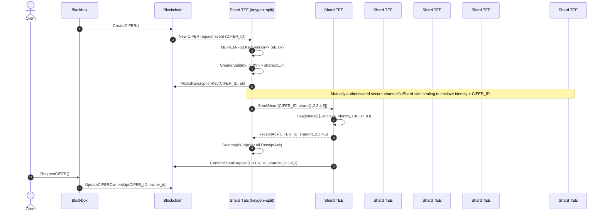
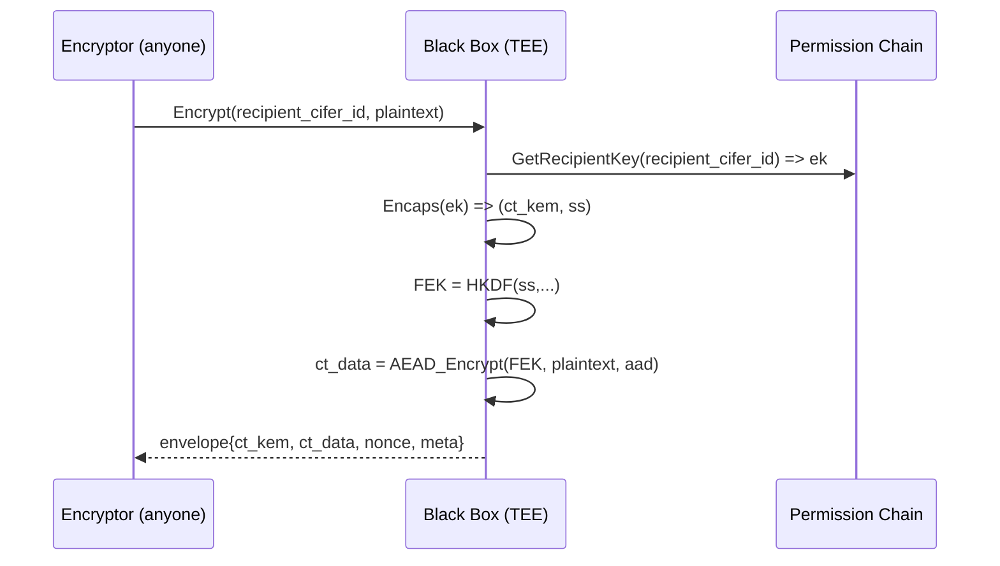
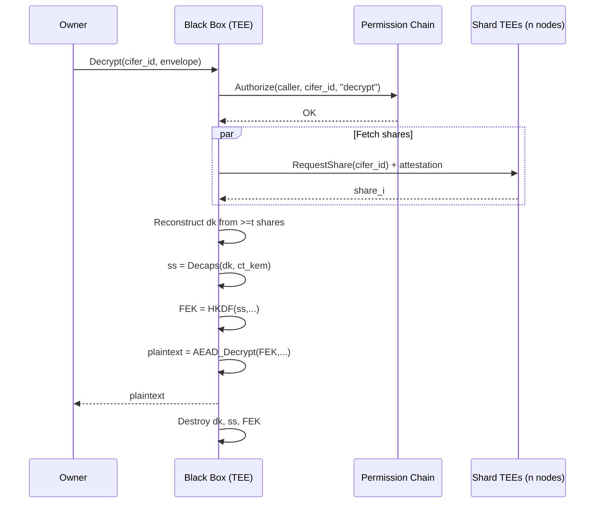

# CIFER Security — Zero‑Key Encryption Architecture and Protocol Specification 
> **Version:** 0.1   
> **Date:** 2025‑12‑28  
> **Scope:** This document turns the public "high‑level architecture" description into an implementable technical specification, aligned with the behavior described (CIFER creation → ML‑KEM‑768 key material → shard across TEE network → encrypt uploads → only owner can decrypt via Black Box).

---

## 1. Problem Statement and Design Goals

Traditional encryption fails operationally because humans and applications struggle to manage keys correctly. CIFER Security's goal is to remove key management from users and apps ("zero‑key encryption"), while still providing strong confidentiality and shareability.

### Primary Goals

| Goal | Description |
|------|-------------|
| **Zero‑key UX** | Users/apps never handle long‑term secret keys |
| **Post‑quantum confidentiality** | Use ML‑KEM‑768, the NIST standardized lattice‑based KEM in FIPS 203 |
| **Decentralized key custody** | The decryption key is not held by any one server at rest; it is distributed across multiple TEEs, with each TEE holding at most 30% of the key material and being geographically distributed |
| **Verifiable execution** | The Black Box is open‑source and runs inside a TEE, so it can be verified/attested and does not store keys persistently |
| **Permissioned decryption** | Anyone can encrypt for a CIFER, but only the CIFER owner can decrypt, enforced via a permission system connected to a blockchain |

---

## 2. High‑Level Architecture

At the center of the system is a **Black Box** service. The Black Box connects to:

1. A **network of TEE servers** that store protected key shares (distributed, geo‑separated)
2. A **blockchain** used to manage permissions (who can do what)

The runtime model operates as follows: requests route into a TEE enclave, keys are generated and used inside it, and only encrypted output is returned (keys never leave enclaves).

---

## 3. Entities, Roles, and Terminology

### 3.1 Entities

| Entity | Description |
|--------|-------------|
| **User / App (Client)** | Sends plaintext to encrypt; receives ciphertext; may request decrypt if authorized |
| **CIFER (logical identity)** | A key‑protected object owned by a single owner identity; used as a target for encryption |
| **Black Box (TEE enclave)** | Open‑source, verifiable component that: creates CIFERs, performs encryption operations, coordinates decryption by retrieving key shares from the TEE network, enforces permissions via the chain |
| **Shard TEEs (TEE network)** | Independent enclaves that store key shares. Each holds ≤30% of a key; distributed geographically |
| **Permission Chain (blockchain)** | Tamper‑evident registry of CIFER metadata and authorization rules |

### 3.2 Roles

| Role | Description |
|------|-------------|
| **Owner** | The identity allowed to decrypt the CIFER's ciphertexts |
| **Encryptor/Sender** | Any user/app that encrypts data to a CIFER (could be the owner or someone else) |

---

## 4. Cryptographic Building Blocks

### 4.1 ML‑KEM‑768 (FIPS 203)

CIFER Security uses **ML‑KEM‑768 (FIPS‑203)** as the post‑quantum standard.

FIPS 203 specifies ML‑KEM and includes parameter sets ML‑KEM‑512 / 768 / 1024, with ML‑KEM‑768 being one of the standard choices.

#### ML‑KEM Conceptual Interface

```
KeyGen() -> (ek, dk)
Encaps(ek) -> (ct_kem, ss)
Decaps(dk, ct_kem) -> ss
```

Where `ss` is a **32‑byte shared secret** in the standard.

### 4.2 Symmetric Encryption (Data Plane)

Use a standard **AEAD** (Authenticated Encryption with Associated Data):

- **AES‑256‑GCM**, or
- **XChaCha20‑Poly1305**

This spec treats the AEAD as a replaceable module (algorithm IDs included in ciphertext headers).

### 4.3 KDF (Key Derivation Function)

Derive a file encryption key (FEK) from the ML‑KEM shared secret:

```
FEK = HKDF(ss, salt = header_salt, info = context_string)
```

### 4.4 Key Splitting Across TEEs

The ML‑KEM decapsulation key (`dk`) must be split into multiple shares and stored across different shard TEEs, such that:

- No single TEE can reconstruct the key
- The Black Box reconstructs it only inside its own enclave when an authorized decrypt is requested

> **Note:** "Each TEE secures at most 30% of a key" implies **N ≥ 4 shards** (so each can hold ≤25% if evenly split), or more generally a threshold scheme where a share is useless alone.

A standard approach is a **threshold secret sharing scheme** (e.g., Shamir's Secret Sharing) with parameters `(t, n)`:

| Parameter | Description |
|-----------|-------------|
| `n` | Number of shard TEEs storing shares |
| `t` | Minimum shares required to reconstruct |

**Required Properties:**

- Compromise of fewer than `t` shard TEEs does not reveal `dk`
- Availability remains acceptable (decrypt requires reaching ≥ `t` TEEs)

---

## 5. Identity and Permission Model

### 5.1 Owner Identity

Owner identity can be represented as:

- A **blockchain address**, or
- An **application account** mapped to on‑chain authorization

> The system may abstract chain identity behind an application account while still using a blockchain for permission logic (email verification only, "no wallet required").

### 5.2 Permission Chain Responsibilities

The permission chain stores or references:

- `CIFER_ID`
- `owner identity`
- Current `ek` (encapsulation key) or a pointer to it
- Policy rules (who may call decrypt, rotate keys, revoke, etc.)
- Optionally: attested shard set membership and/or receipts

---

## 6. Core Protocols

### 6.1 Protocol A — Create CIFER

**Goal:** Create a new CIFER owned by a user, with ML‑KEM‑768 decapsulation material split and distributed.

#### Inputs

- `owner_id` (authenticated session / identity)
- Optional policy parameters (share threshold, regions, etc.)

#### Steps

1. **Blackbox -> Blockchain:** `CreateCIFER()`

2. **Shard TEE (one of five):** Sees new Cifer request on blockchain and run `ML‑KEM‑768.KeyGen()` to generate `(ek, dk)`

3. **Shard TEE (one of five):** Splits `dk` into `n` shares with threshold `t`

4. **Shard TEE (one of five):** sends `ek` to blockchain for public retrival
5. **Shard TEE → Shard TEEs:** Sends one share to each shard enclave, using:
   - Mutually authenticated secure channels
   - Shard‑side "sealing" to enclave identity and `CIFER_ID`
   - destroys the `dk` upon receipt confirmation from other Shard TEEs

6. **Shard TEEs → Blockchain:** Submit confirmation of shards deposit

7. **Client -> Black Box -> blockchain:** 
   
   Requests CIFER from blackbox
   Blackbox updates ownership of CIFER with `owner id` on blockchain


#### Outcome

- ✅ CIFER exists
- ✅ `ek` is retrievable (for encryption)
- ✅ `dk` exists only as distributed shares in the shard TEE network


---

### 6.2 Protocol B — Encrypt Data to a CIFER

**Goal:** Encrypt a file/message so that only the CIFER owner can decrypt.

> This is the "anyone can encrypt data for a CIFER" property.

#### Inputs

- `recipient_cifer_id`
- `plaintext` (file bytes or message)
- Optional metadata (filename, content type)

#### Steps

1. **Client → Black Box:** `Encrypt(recipient_cifer_id, plaintext, metadata)`

2. **Black Box → Chain:** Fetches recipient CIFER record:
   - Validates CIFER exists
   - Obtains `ek`

3. **Black Box (inside TEE):**
   - Runs `Encaps(ek) -> (ct_kem, ss)`
   - Derives `FEK = HKDF(ss, …)`
   - Generates random nonce
   - Encrypts plaintext using AEAD:
     ```
     ct_data = AEAD_Encrypt(FEK, nonce, plaintext, aad=header_fields)
     ```

4. **Black Box → Client:** Returns an envelope containing:
   - `version`
   - `recipient_cifer_id`
   - `kem_alg = ML-KEM-768`
   - `ct_kem`
   - `aead_alg`
   - `nonce`
   - `ct_data`
   - `aad / metadata` (optional)

5. **Black Box:** Wipes `ss`, `FEK`, and intermediate buffers

#### Encrypting "For Me" vs "For Someone Else"

| Scenario | Configuration |
|----------|---------------|
| **For me** | `recipient_cifer_id = my_cifer_id` |
| **For someone else** | Use the other person's `recipient_cifer_id` (their CIFER) |

No decryption delegation is required: the recipient's owner can decrypt with their own CIFER.

---

### 6.3 Protocol C — Decrypt (Owner Only)

**Goal:** Recover plaintext only if the caller is authorized by chain rules (default: owner only).

> This is the "only the CIFER owner can decrypt it" property.

#### Inputs

- `encrypted_data`
- `meta_data: signature of owner on decrypt request with replay attack protection based on blockchain and cifer_id`

#### Steps

1. **Client → Black Box:** `Decrypt(encrypted_data, meta_data)`

2. **Black Box → Chain:** Verifies authorization:
   - Caller is owner (or otherwise authorized by explicit policy)
   - Request is valid (rate limits, replay protection.)

3. **Black Box ↔ Shard TEEs:** Obtains ≥ `t` shares:
   - Shard TEEs verify:
     - Black Box is a valid attested enclave running approved open‑source code
     - Chain state authorizes this decrypt
   - Shard TEEs return shares over encrypted channels

4. **Black Box (inside TEE):**
   - Reconstructs `dk` from shares
   - Runs `Decaps(dk, ct_kem) -> ss`
   - Derives `FEK = HKDF(ss, …)`
   - Decrypts: `plaintext = AEAD_Decrypt(FEK, nonce, ct_data, aad)`

5. **Black Box → Client:** Returns `plaintext`

6. **Black Box:** Wipes reconstructed `dk`, `ss`, `FEK`, shares, and intermediate buffers

> **Key point:** The Black Box "never stores keys — it only processes them securely."

---

## 7. Data Formats

### 7.1 CIFER Record (Logical)

```yaml
cifer_id: bytes32 | uuid
owner_id: identity
ek: bytes  # ML‑KEM‑768 encapsulation key
policy:
  decrypt_rules: ...
  rotation_rules: ...
created_at: timestamp
updated_at: timestamp
```

### 7.2 Encrypted Envelope (Returned by Encrypt)

A typical binary layout:

| Field | Description |
|-------|-------------|
| Magic + Version | Format identifier |
| Recipient CIFER_ID | Target CIFER |
| Algorithm identifiers | KEM and AEAD algorithms |
| `ct_kem` | KEM ciphertext |
| AEAD nonce | Random nonce |
| AEAD ciphertext (`ct_data`) | Encrypted data including auth tag |
| Optional metadata | Additional context |

> **Important:** The envelope must bind critical fields into AEAD AAD (e.g., `CIFER_ID`, algorithm IDs, version) to prevent substitution attacks.

---

## 8. Security Properties

### 8.1 Confidentiality Against Platform Operators

- **Zero‑knowledge / zero access posture:** Operators/admins/providers cannot access plaintext or keys
- Keys are generated/used inside TEEs and not returned

### 8.2 Decentralized Custody / Reduced Single‑Point Compromise

- No single shard TEE holds enough key material (≤30% per TEE)
- TEEs are geographically distributed
- Decryption requires quorum retrieval and reconstruction in the Black Box enclave

### 8.3 Post‑Quantum Readiness

- Uses **ML‑KEM‑768**, standardized in NIST FIPS 203

### 8.4 Public Encryption, Restricted Decryption

- Anyone can encrypt to a CIFER
- Only owner can decrypt

---

## 9. Threat Model and Limitations

This architecture is strong, but it does not eliminate all risks:

| Threat | Description |
|--------|-------------|
| **Compromised client endpoint** | If malware controls the user's device/browser, plaintext can be stolen before encryption or after decryption |
| **TEE risks** | TEEs reduce attack surface, but side‑channels or implementation flaws are still a class of risk; the design mitigates by distributing custody (no single enclave holds full key) |
| **Availability** | Decrypt requires contacting ≥ `t` shard TEEs. If too many are offline, decrypt may fail until quorum is restored |
| **Chain governance** | The chain is a critical policy root. If chain rules or `n > threshold` keys for technical committee are compromised, permissions can be affected (though ciphertext confidentiality still relies on TEE + key splitting) |

---

## 10. Implementation Requirements Checklist

### Black Box Enclave

- [ ] Must be **open‑source** and attested/verifiable
- [ ] Must **never persist** `dk`, shares, or derived secrets
- [ ] Must **enforce chain authorization** before attempting shard retrieval

### Shard TEEs

- [ ] Must store only key shares (**≤30% per shard**) and be geo‑distributed
- [ ] Must release shares only after:
  - [ ] Validating Black Box attestation
  - [ ] Validating on‑chain authorization

### Cryptography

- [ ] **ML‑KEM‑768** per FIPS 203
- [ ] Use AEAD with strong nonce discipline
- [ ] **Zeroize secrets promptly** (including reconstructed `dk`)

---

## 11. Sequence Diagrams

### 11.1 Create CIFER



### 11.2 Encrypt



### 11.3 Decrypt (Owner)



---


